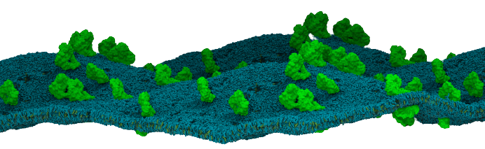

.. membrane_curvature documentation master file, created by
   sphinx-quickstart on Thu Mar 15 13:55:56 2018.
   You can adapt this file completely to your liking, but it should at least
   contain the root `toctree` directive.

Welcome to MembraneCurvature's Documentation
=========================================================

**Minimum MDAnalysis version:** |MDAnalysis_version|

**Last updated:** |today|

The MDAnalysis **MembraneCurvature** tool module calculates the Gaussian and mean 
curvature from Molecular Dynamics (MD) simulations. 

**MembraneCurvature** derives 2D curvature profiles of a surface of reference.
To suit the needs of your system, we offer flexible atom selection that will
enable you to use the most convenient `AtomGroup` to extract curvature from your
MD simulations!

This is an example on how to use MembraneCurvature:

.. code-block:: python

      import MDAnalysis as mda
      from membrane_curvature.base import MembraneCurvature

      u = mda.Universe(coordinates, trajectory)
      mc = MembraneCurvature(u).run()

      surface =  mc.results.average_z_surface
      mean_curvature =  mc.results.average_mean_curvature
      gaussian_curvature = mc.results.average_gaussian_curvature

You can find more details on how to use MembraneCurvature in the `Usage`_ page.

Features
----------

MembraneCurvature calculates mean and Gaussian curvature from MD simulations in:

#. Monolayers.
#. Membrane-only systems.
#. Membrane-protein systems.

Why MembraneCurvature?
-------------------------
**MembraneCurvature** is a user-friendly, actively-maintained, well-documented tool 
in Python 3 to derive 2D maps of membrane curvature from MD Simulations, using the most recent version of `MDAnalysis`_ 
Are you interested in calculating mean and Gaussian curvature from MD simulations? This tool is for you!

Installation
--------------

The main dependency in MembraneCurvature is `MDAnalysis`_. You can find
instructions to install the latest stable version of MDAnalysis via `conda`_ in the `User Guide`_.

MembraneCurvature is available via pip:

.. code-block:: bash

   pip install membrane-curvature

To install from source:

.. code-block:: sh

   git clone https://github.com/MDAnalysis/membrane-curvature.git
   cd membrane-curvature
   conda env create -f devtools/conda-envs/environment.yaml
   conda activate membrane-curvature
   python setup.py install

Some of the examples included in the MembraneCurvature documentation use test
cases from `MDAnalysis Tests`_. To install the unit tests via conda:

.. code-block:: bash

   conda install -c conda-forge MDAnalysisTests

or via pip:

.. code-block:: bash

   pip install --upgrade MDAnalysisTests

.. Contents
.. ========

.. toctree::
   :maxdepth: 2
   :caption: Contents:

   getting_started
   api
   ./source/pages/Algorithm
   ./source/pages/Usage
   ./source/pages/Visualization
   ./source/pages/Tutorials

.. autosummary::
   :toctree: autosummary
   :recursive:

License 
-----------

Source code included in this project is available under the `GNU Public
License v3`_ from `github.com/MDAnalysis/membrane_curvature`_.

.. _`GNU Public License v3`: https://www.gnu.org/licenses/gpl-3.0.en.html
.. _MDAnalysis: https://www.mdanalysis.org
.. _`github.com/MDAnalysis/membrane_curvature`: https://github.com/MDAnalysis/membrane-curvature
.. _`Usage`: https://membrane-curvature.readthedocs.io/en/latest/source/pages/Usage.html
.. _`MDAnalysis Tests`: https://github.com/MDAnalysis/mdanalysis/wiki/UnitTests
.. _`User Guide`: https://userguide.mdanalysis.org/stable/index.html
.. _`conda`: https://conda.io/en/latest/
.. |MDAnalysis_version| replace:: 1.1.1

Indices and tables
==================

* :ref:`genindex`
* :ref:`modindex`
* :ref:`search`

