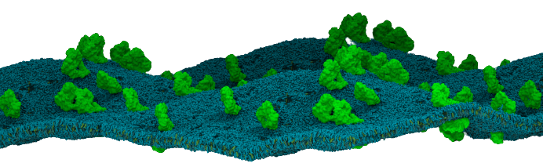

.. membrane_curvature documentation master file, created by
   sphinx-quickstart on Thu Mar 15 13:55:56 2018.
   You can adapt this file completely to your liking, but it should at least
   contain the root `toctree` directive.

Welcome to MembraneCurvature's Documentation
=========================================================

**Minimum MDAnalysis version:** |MDAnalysis_version|

**Last updated:** |today|

The MDAnalysis **MembraneCurvature** tool module calculates the Gaussian and mean 
curvature from Molecular Dynamics (MD) simulations. 

**MembraneCurvature** derives 2D curvature profiles of a surface of reference.
To suit the needs of your system, we offer flexible atom selection that will
enable you to use the most convenient ``AtomGroup`` to extract curvature from your
MD simulations!

This is an example on how to use MembraneCurvature:

.. code-block:: python

      import MDAnalysis as mda
      from membrane_curvature.base import MembraneCurvature

      u = mda.Universe(coordinates, trajectory)
      mc = MembraneCurvature(u).run()

      surface =  mc.results.average_z_surface
      mean_curvature =  mc.results.average_mean_curvature
      gaussian_curvature = mc.results.average_gaussian_curvature

You can find more details on how to use MembraneCurvature in the `Usage`_ page.

Features
----------

MembraneCurvature allows you to:

- Calculate mean and Gaussian curvature from MD simulations.
- Derive 2D curvature profiles from atoms of reference with two different methods: binning or Fourier-based.
- Get per-frame or averaged results for surface, mean and Gaussian curvature.

Why MembraneCurvature?
-------------------------
**MembraneCurvature** is a user-friendly, actively-maintained, well-documented tool 
in Python 3 to derive 2D maps of membrane curvature from MD Simulations, using the most recent version of `MDAnalysis`_ 
Are you interested in calculating mean and Gaussian curvature from MD simulations? This tool is for you!

Installation
--------------

The main dependency in MembraneCurvature is `MDAnalysis`_. Please refer to the `Installation`_ section in the `Getting Started`_ page for
detailed installation instructions.

MembraneCurvature is available via pip, conda, and uv. Please refer to the `Installation`_ section in the `Getting Started`_ page for
detailed installation instructions.

.. Contents
.. ========

.. toctree::
   :maxdepth: 3
   :caption: Contents:

   getting_started
   api
   ./source/pages/Algorithm
   ./source/pages/Usage
   ./source/pages/Visualization
   ./source/pages/Tutorials

.. autosummary::
   :toctree: autosummary
   :recursive:

License 
-----------

Source code included in this project is available under the `GNU Public
License v3`_ from `github.com/MDAnalysis/membrane_curvature`_.

.. _`GNU Public License v3`: https://www.gnu.org/licenses/gpl-3.0.en.html
.. _MDAnalysis: https://www.mdanalysis.org
.. _`github.com/MDAnalysis/membrane_curvature`: https://github.com/MDAnalysis/membrane-curvature
.. _`Usage`: https://membrane-curvature.readthedocs.io/en/latest/source/pages/Usage.html
.. _`MDAnalysisTests`: https://github.com/MDAnalysis/mdanalysis/wiki/UnitTests
.. _`MDAnalysisData`: https://www.mdanalysis.org/MDAnalysisData/
.. _`Installation Quick Start`: https://www.mdanalysis.org/pages/installation_quick_start/#installation-quick-start
.. _`Installation`: https://membrane-curvature.readthedocs.io/en/latest/getting_started.html#installation
.. _`Getting Started`: https://membrane-curvature.readthedocs.io/en/latest/getting_started.html
.. _`conda`: https://conda.io/en/latest/
.. |MDAnalysis_version| replace:: 2.4.0

Indices and tables
==================

* :ref:`genindex`
* :ref:`modindex`
* :ref:`search`

