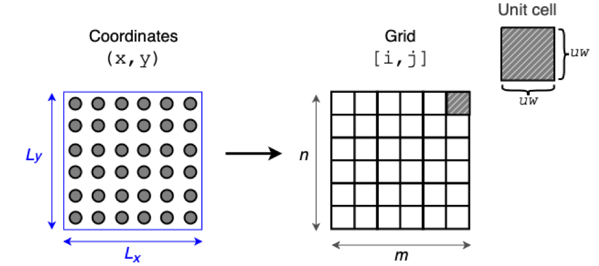

Algorithm
=========================================================

The membrane curvature MDANAlysis module calculates mean and gaussian curvature 
from surfaces derived by a group of reference. By default, the group of reference 
implemented are lipid headgroups.

The algorithm locates all the atoms in the group of reference and map each element 
of the group to a grid of `m x n` dimensions. The dimensions of the grid are 
determined by the length of the simulation box in the first frame of the 
trajectory.

The grid is then divided in `n x m` elements, with unit cells of width 2nm (default 
value). In this way, for every atom in the group of reference an indexed cell in 
the grid is assigned. i.e. `(x, y) ↦ [i, j]`. 

|grid|

Once the grid is populated with the atoms in the group of reference, the respective 
`z` coordinate is stored in element in an individual array of each `[i, j]`. This 
operation is performed for every frame in the trajectory. Then, after iterating 
over every frame of the trajectory, the mean value of the stored `z` coordinate 
are calculated. These mean values of `z` are the ones used to derive the surface.

With the define surface, then values of mean (`H`) and gaussian (`K`) curvature 
are calculated. This analysis returns a 2-dimensional array with the values of mean
mean and gaussian curvature. 

More information on how to visualize the results of the MDAnalysis Membrane 
Curvature toolkit can be found in the :doc:`Visualization` page .

.. _Visualization: