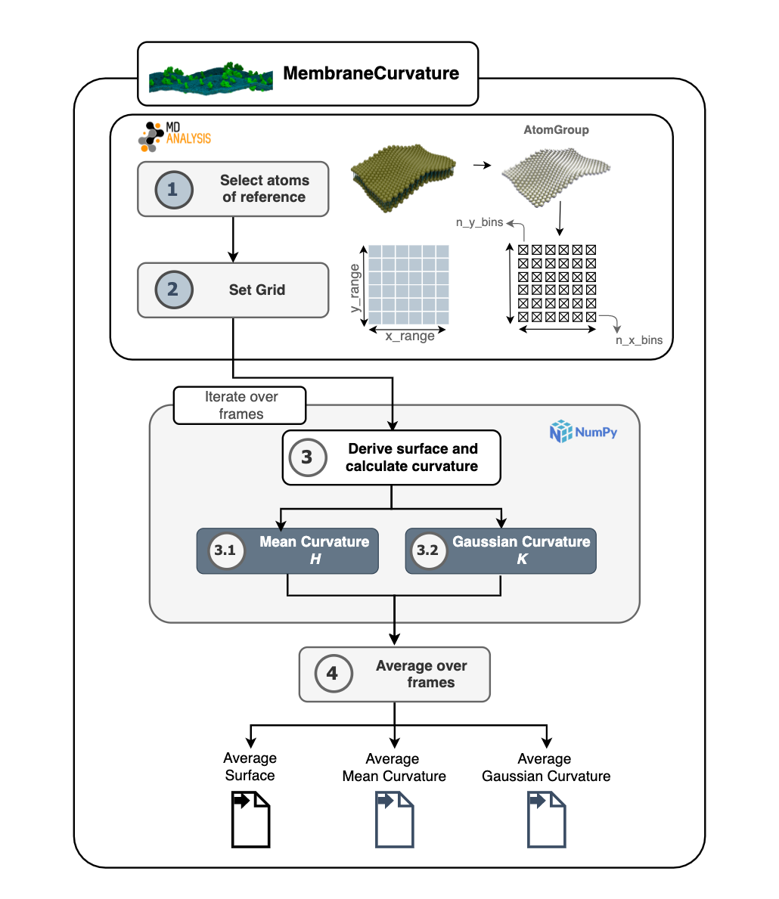
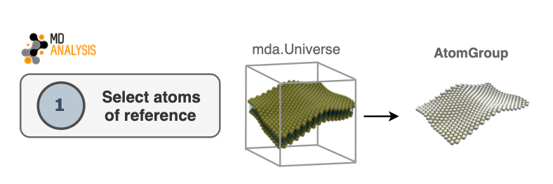
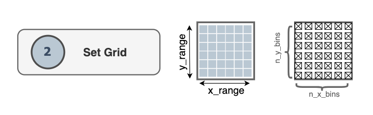
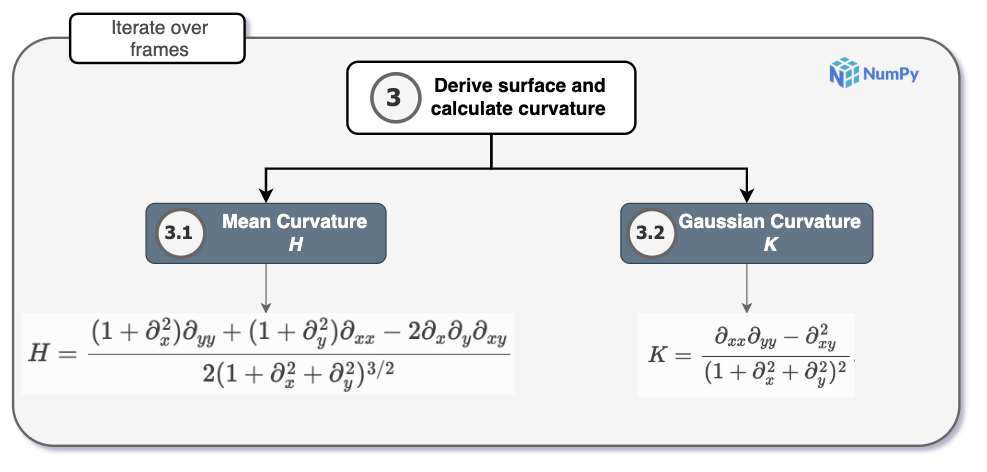
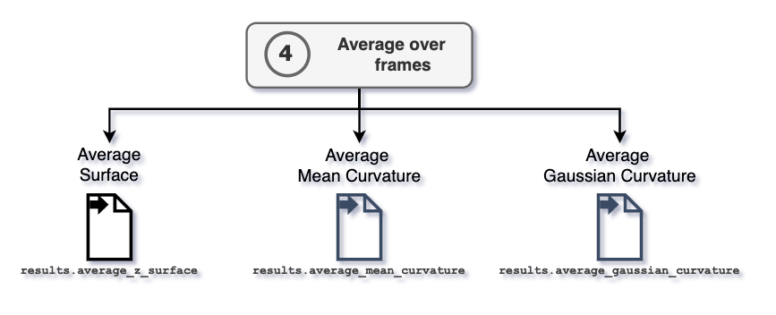

.. role:: raw-math(raw) :format: latex html

Algorithm
=========================================================

Overview
---------

MembraneCurvature calculates mean and Gaussian curvature of surfaces derived
from atoms of reference in 4 steps:

:ref:`select-atoms`

:ref:`set-grid`

:ref:`derive-surface-curvature` 

:ref:`iterate`

A summary of the algorithm used in MembraneCurvature is shown in the following
diagram:

|diagram|

.. _select-atoms:

1. Select atoms of reference
-----------------------------

The first step in the algorithm consists in selecting atoms that will be used as
a reference to derive a surface. This selection will be contained in an
AtomGroup. Typically in biological membranes, lipid headgroups are the most
common elements to use as an AtomGroup of reference. 

|atoms|

.. _set-grid:

2. Set grid
-------------
The dimensions of the grid are determined by the size of the simulation box
contained in the `MDAnalysis Universe`_. The grid comprises `n_x_bins` x `n_y_bins` number of bins.

|grid|

For every atom in the AtomGroup of reference, MembraneCurvature assigns an index
in the grid, according to their respective `x` and `y` coordinates. i.e. `(x, y) ↦ [l, m]`. 

.. note::
  Unless the user provides a different input, the dimensions of the grid will be determined by

  .. code-block:: python

      grid_dimension_x = (0, universe.dimensions[0])
      grid_dimension_y = (0, universe.dimensions[1])

Once the grid is populated according to the coordinates of the atoms in the
AtomGroup of reference, the associated `z` coordinate of each atom in the AtomGroup 
is stored in an array assigned to each `[l, m]` index.

.. _derive-surface-curvature:

3. Derive surface and calculate curvature
------------------------------------------

Once the surface formed by the atoms of reference is derived, values of mean (`H`)
and Gaussian (`K`) curvature are calculated according to their respective equations.

For every frame of the trajectory, the surface derived from the `AtomGroup` is
calculated and stored in :attr:`MembraneCurvature.results.z_surface`.
Similarly, the calculation of mean and Gaussian curvature is performed in every
frame and stored in :attr:`MembraneCurvature.results.mean_curvature` and
:attr:`MembraneCurvature.results.gaussian_curvature`, respectively.

|surf|

.. _iterate:

4. Average over frames
-----------------------------------

The attributes :attr:`MembraneCurvature.results.average_mean_curvature` and
:attr:`MembraneCurvature.results.average_gaussian_curvature` contain the computed
values of mean and Gaussian curvature averaged over the `n_frames` of the
trajectory. 

After performing the average over frames, the 
:attr:`~MembraneCurvature.results.average_z_surface`
:attr:`~MembraneCurvature.results.average_mean_curvature`, 
:attr:`~MembraneCurvature.results.average_gaussian_curvature` arrays have shape 
`(n_x_bins, n_y_bins)`.

|avg_frames|

.. |grid_map| image:: ../_static/gridmap.png
  :width: 400
  :alt: GridMap

.. _`MDAnalysis Universe`: https://docs.mdanalysis.org/2.0.0-dev0/documentation_pages/core/universe.html?highlight=universe
