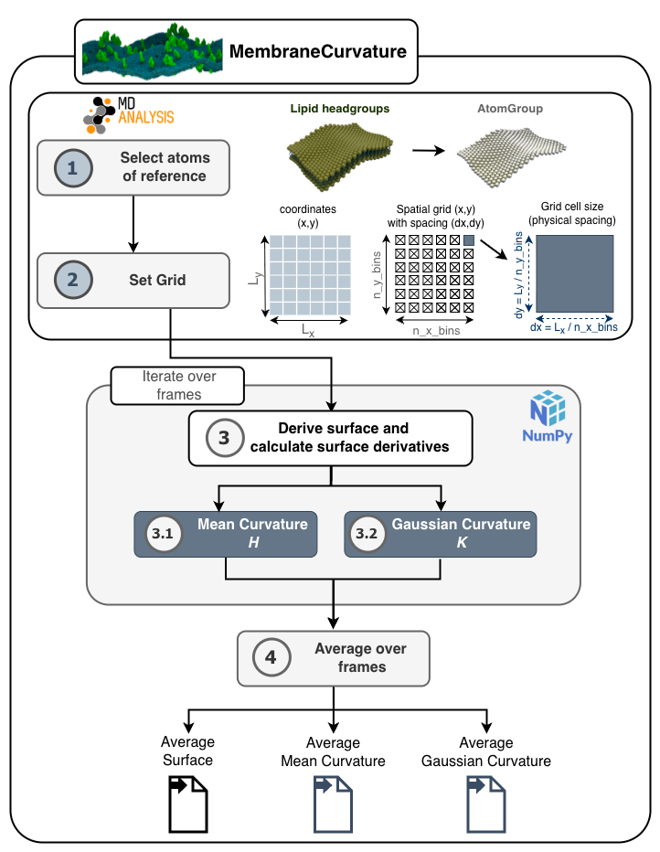
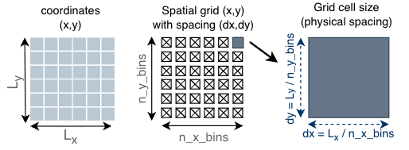
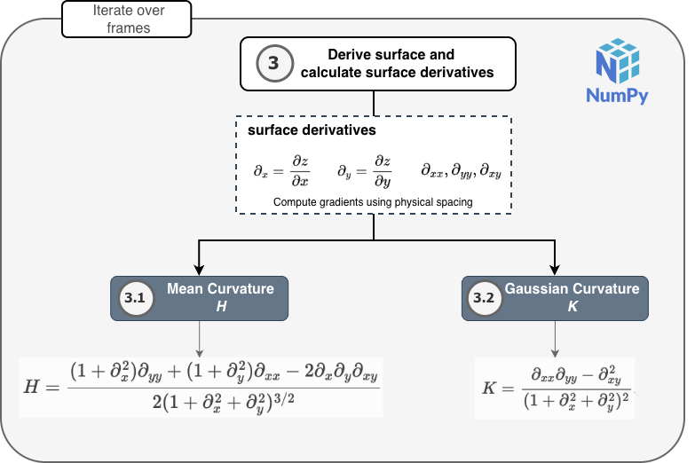
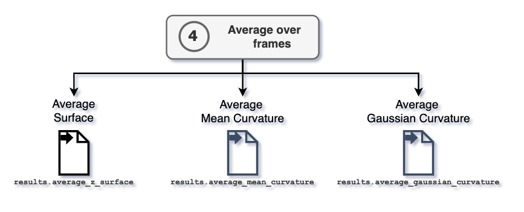

Algorithm
=========================================================

Overview
---------

MembraneCurvature calculates mean and Gaussian curvature of surfaces derived
from atoms of reference in 4 steps:

:ref:`select-atoms`

:ref:`set-grid`

:ref:`derive-surface-curvature` 

:ref:`iterate`

A summary of the algorithm used in MembraneCurvature is shown in the following
diagram:

|diagram|

.. _select-atoms:

1. Select atoms of reference
-----------------------------

The first step in the algorithm consists of selecting atoms that will be used as
a reference to derive a surface. This selection will be contained in an
:class:`~MDAnalysis.core.groups.AtomGroup`. Typically in biological membranes,
lipid headgroups are the most common elements to use as an AtomGroup of
reference. 

|atoms|

.. _set-grid:

2. Set grid
-------------
The dimensions of the grid are determined by the size of the simulation box
contained in the :class:`~MDAnalysis.core.universe.Universe`.
The grid covers a rectangular domain in the membrane plane. By default that
domain matches the `x` and `y` edges of the simulation box from MDAnalysis'
:class:`~MDAnalysis.core.universe.Universe`.The grid comprises ``n_x_bins`` x 
``n_y_bins`` bins along the `x` and `y` directions.

For every atom in the :class:`~MDAnalysis.core.groups.AtomGroup` of reference,
MembraneCurvature assigns it to a grid cell based on its `x` and `y` coordinates.
In practice, each coordinate pair ``(x, y)`` is mapped to a grid location
``[l, m]`` corresponding to a bin in the discretized membrane surface.

|grid|

Here, :math:`L_x` and :math:`L_y` represent the size of the region covered by
the grid along the `x` and `y` directions (i.e. the span of ``x_range`` and
``y_range``). The spacing between grid points in each direction is then
determined by dividing these lengths by the number of bins:

.. math::

   dx = \frac{L_x}{n_x\_bins}, \qquad dy = \frac{L_y}{n_y\_bins}

These spacings are used in derivative calculations so that curvature is computed
in physical units.

Once the grid has been populated, the `z` coordinates of atoms assigned to each
cell are collected to form a height field over the grid.

.. note::
  Unless the user provides a different input, MembraneCurvature will determine
  the dimensions of the grid based on the size of the box on the first frame via
  :attr:`~MDAnalysis.core.universe.Universe.dimensions`.

  .. code-block:: python

      grid_dimension_x = (0, universe.dimensions[0])
      grid_dimension_y = (0, universe.dimensions[1])

.. _derive-surface-curvature:

3. Derive surface and calculate surface derivatives
---------------------------------------------------

Once the surface formed by the atoms of reference is derived, mean (`H`) and
Gaussian (`K`) curvature are calculated from its spatial derivatives. These
derivatives are evaluated using the actual grid spacing (``dx``, ``dy``), so that changes
in height are measured per unit distance in real space rather than per grid index.
This makes curvature values physically meaningful and reduces their sensitivity
to the chosen grid resolution.

.. note::
   Curvature is computed from surface derivatives evaluated using the grid spacing
   (``dx``, ``dy``), ensuring results are expressed in physical units and are less
   sensitive to grid resolution. Because the derivatives are computed numerically,
   very coarse grids may still affect curvature estimates due to finite-difference
   discretization error.

For every frame of the trajectory, the surface derived from the 
:class:`~MDAnalysis.core.groups.AtomGroup` is
calculated and stored in :attr:`~MembraneCurvature.results.z_surface`.
Similarly, the calculation of mean and Gaussian curvature is performed in every
frame and stored in :attr:`MembraneCurvature.results.mean_curvature` and
:attr:`MembraneCurvature.results.gaussian_curvature`, respectively.

|surf|

.. _iterate:

4. Average over frames
-----------------------------------

The attributes :attr:`MembraneCurvature.results.average_mean` and
:attr:`MembraneCurvature.results.average_gaussian` contain the computed
values of mean and Gaussian curvature averaged over all the 
:attr:`~n_frames` in the trajectory. 

After performing the average over frames, the information of average surface,
mean, and Gaussian curvature are stored in the 
:attr:`MembraneCurvature.results.average_z_surface<membrane_curvature.base.MembraneCurvature.results.average_z_surface>`,
:attr:`MembraneCurvature.results.average_mean`, and
:attr:`MembraneCurvature.results.average_gaussian` arrays, respectively.
Each array has shape ``(n_x_bins, n_y_bins)``.

|avg_frames|

