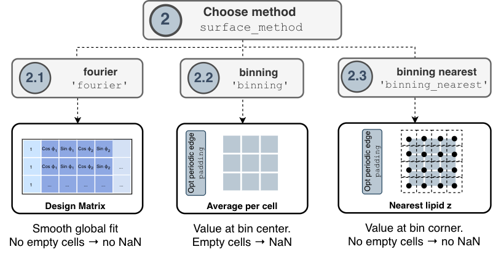
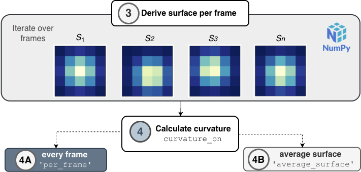
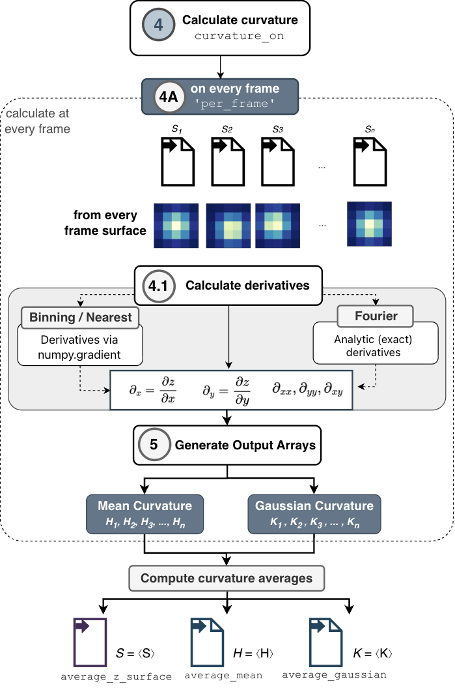
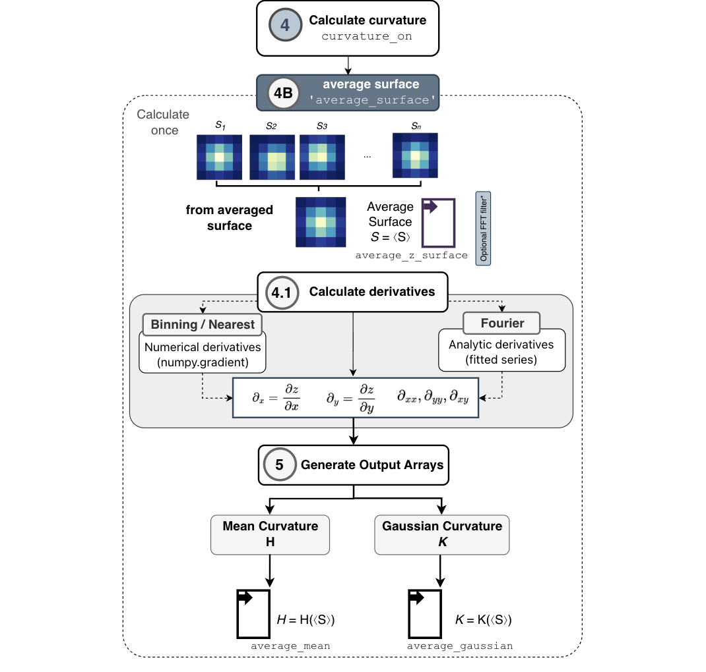
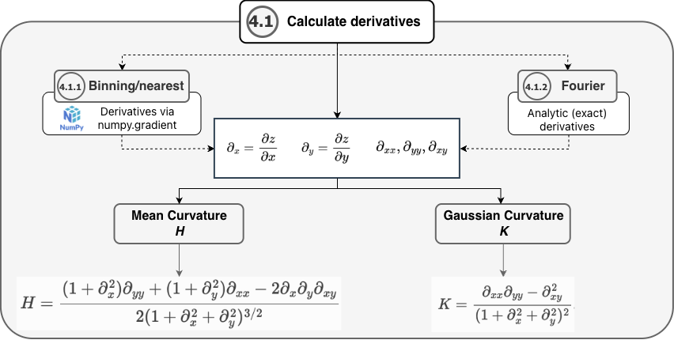
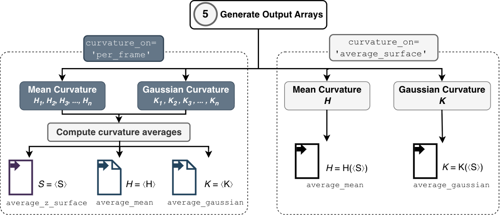

.. _algorithm:

Algorithm
=========================================================

Overview
---------

MembraneCurvature calculates mean and Gaussian curvature of surfaces derived
from atoms of reference in five steps:

:ref:`select-atoms`

:ref:`choose-surface-method`

:ref:`derive-surface-per-frame`

:ref:`calculate-curvature`

:ref:`generate-output-arrays`

A summary of the algorithm used in MembraneCurvature is shown in the following
diagram:

|diagram|

.. _select-atoms:

1. Select atoms of reference
-----------------------------

The first step in the algorithm is defining the reference atoms with the ``select``
parameter. :class:`~MembraneCurvature.base.MembraneCurvature` builds on the MDAnalysis
selection to create an :class:`~MDAnalysis.core.groups.AtomGroup` of reference, which is
then used to derive surfaces.

For biological membranes, lipid headgroups are commonly used as reference atoms.

|atoms|

.. _choose-surface-method:

2. Choose surface method
------------------------

To derive surfaces from the reference atoms, :class:`~membrane_curvature.base.MembraneCurvature`
has three methods available, selected via the ``surface_method`` argument:

- :ref:`fourier_method` (``surface_method='fourier'``) - Default

  A truncated 2D Fourier series is fitted to atom heights by linear
  least squares at each frame. Partial derivatives are evaluated analytically
  from the fitted series on the same grid as the binning method, avoiding
  finite-difference discretization error.
  See :mod:`~membrane_curvature.fourier_surface` for details.

- :ref:`binning_method` (``surface_method='binning'``)

  Atoms are assigned to bins on a regular grid and the height at each bin centre
  is set to the mean :math:`z`-coordinate of the atoms in that bin. Partial derivatives
  are estimated numerically from the discrete height field using
  :func:`numpy.gradient` with the physical bin spacing.
  See :mod:`~membrane_curvature.binning_surface` for details.

- :ref:`binning_nearest_method` (``surface_method='binning_nearest'``)

  Grid corners are placed on a regular grid and the height at each grid corner
  is set to the :math:`z`-coordinate of the nearest lipid in the :math:`xy` plane.
  Partial derivatives   are estimated numerically from the discrete height field using
  :func:`numpy.gradient` with the physical bin spacing.
  See :mod:`~membrane_curvature.binning_nearest_surface` for details.

|surface-methods|

.. _fourier_method:

2.1 Fourier method
--------------------

``surface_method='fourier'`` is the default method used in Membrane Curvature.
The Fourier method fits a truncated periodic 2D Fourier series to atom heights
by linear least squares at each frame. 
The truncation is controlled by ``fourier_m`` and ``fourier_n`` (default ``2``).
The basis is periodic on the simulation box with periods :math:`L_x` and :math:`L_y`,
so the fitted surface is consistent with periodic boundary conditions in :math:`x` and
:math:`y`.

The Fourier expansion used as a basis is given by:

.. math::
   z(x, y) = A_{00} + \sum_{(m,n)\,\in\,\mathcal{M}}\left[
     A_{mn}\cos\!\big(k_x m x + k_y n y\big)
     +\,B_{mn}\sin\!\big(k_x m x + k_y n y\big)
   \right],

where the retained mode set :math:`\mathcal{M}` is the non-redundant list built by
:func:`~membrane_curvature.fourier_surface.fourier_mode_list`:

.. math::
   \mathcal{M} =
   \big\{(m,n):\; m=1,\ldots,M,\; n=-N,\ldots,N\big\}
   \;\cup\;
   \big\{(0,n):\; n=1,\ldots,N\big\},

and the mean term :math:`A_{00}` corresponds to :math:`(m,n)=(0,0)` and it is kept
outside the sum.

Here, :math:`k_x` and :math:`k_y` are the fundamental wavevector components:

.. math::

  k_x = \frac{2\pi}{L_x}, \qquad k_y = \frac{2\pi}{L_y}

so the phase for mode ``(m,n)`` is

.. math::

  \phi_{mn} = k_x m x + k_y n y.

The Fourier method in MembraneCurvature is conceptually related to Fourier
surface modeling [CAG2009]_ and molecular Fourier shape descriptors [JMG1988]_,
but it is not a direct implementation of either paper. The least-squares
height-field fit used in MembraneCurvature is tailored to the AtomGroup of
reference given their cordinates.

.. [CAG2009] Shen et al., *Fourier method for large-scale surface modeling and registration*,
   Computers & Graphics (2009), doi: `10.1016/j.cag.2009.03.002`_.

.. [JMG1988] Leicester et al., *Description of molecular surface shape using Fourier descriptors*,
   Journal of Molecular Graphics (1988), doi: `10.1016/0263-7855(88)85008-2`_.

The full Fourier surface workflow comprises six steps, where the first four steps build and
solve a linear model that reconstructs the height field from plane-wave basis
functions. The final two steps evaluate the fitted surface and its derivatives
analytically on a grid of bin centres. In the following sections, we describe the
overall workflow implemented in MembraneCurvature. For details on each step and
the associated functions, see the API documentation in
:mod:`~membrane_curvature.fourier_surface`.

2.1.1 Choose Fourier modes
^^^^^^^^^^^^^^^^^^^^^^^^^^^
The first step is to choose a non-redundant set of Fourier modes with
:func:`~membrane_curvature.fourier_surface.fourier_mode_list` and determine the
total parameter count with :func:`~membrane_curvature.fourier_surface.n_fourier_parameters`.
This removes conjugate redundancy for real-valued surfaces and isolates the
mean term.

|fourier_modes|

2.1.2 Compute wavevectors
^^^^^^^^^^^^^^^^^^^^^^^^^^
We then compute the wavevector components (:math:`k_x`, :math:`k_y`) for each mode
using :func:`~membrane_curvature.fourier_surface._compute_wavevector`. These
set the phase :math:`\phi = k_x x + k_y y` that appears in each cosine/sine
basis function.

MembraneCurvature builds the non-redundant mode list via :func:`~membrane_curvature.fourier_surface.fourier_mode_list(M, N)`
and computes the total parameter count with :func:`~membrane_curvature.fourier_surface.n_fourier_parameters(M, N)`.
MembraneCurvature then validates that the :class:`~MDAnalysis.core.groups.AtomGroup` of reference
contains at least that many atoms and raises a :class:`ValueError` if the selection is too small.

.. warning::

  The explanation above is for the users to understand how MembraneCurvature builds the mode list and parameter count internally.

  **Do not pass the mode list** :func:`~membrane_curvature.fourier_surface.fourier_mode_list(M, N)`
  **or parameter count** :func:`~membrane_curvature.fourier_surface.n_fourier_parameters(M, N)`
  **directly. MembraneCurvature builds them internally.**

  **Users choose the Fourier truncation via the constructor arguments** ``fourier_m`` **and** ``fourier_n``
  By passing the maximum mode indices, MembraneCurvature builds the actual mode list and computes the total
  parameter count.

.. important::
  
  Because the derivatives are analytic, the Fourier method is not subject
  to finite difference discretization error from the bin grid. Curvature
  still depends on the Fourier series truncation: use
  ``fourier_m = fourier_n = 2`` unless shorter wavelengths are required, and
  increase these values only while curvature improves systematically rather than
  becoming dominated by noise.

.. _build-design-matrix:

2.1.3 Build design matrix
^^^^^^^^^^^^^^^^^^^^^^^^^^
We then build the design matrix with :func:`~membrane_curvature.fourier_surface._build_fourier_matrix`.
Each row of the design matrix corresponds to an atom position and columns are the constant offset
followed by :math:`\cos(\mathbf{k}\cdot\mathbf{r})`, :math:`\sin(\mathbf{k}\cdot\mathbf{r})`
pairs for every retained mode. This matrix encodes the linear relation between the
Fourier coefficients and the observed heights.

The design matrix :math:`\mathbf{\Phi}` is a matrix of shape :math:`(N, P)` where
:math:`N` is the number of atoms in the :class:`~MDAnalysis.core.groups.AtomGroup`
of reference, and :math:`P` is the number of parameters. :math:`P` is defined
as :math:`P = 1 + 2\,n_{\text{modes}}` where :math:`n_{\text{modes}}` is the number of
the k retained Fourier modes. 

We can conceptualize :math:`\mathbf{\Phi}` as a matrix with rows corresponding to atom positions
and columns corresponding to the basis functions (cosine and sine of the wavevector :math:`k`)
evaluated at each atom position, so that the fitted heights satisfy the linear system of equations
:math:`\mathbf{z} \approx \mathbf{\Phi}\,\boldsymbol{\theta}`, from which we can solve
for the Fourier coefficients by solving a least-squares system.

A single row :math:`i` of :math:`\mathbf{\Phi}` for an atom at
:math:`\mathbf{r}_i=(x_i,y_i)` has the form:

.. math::

   \begin{aligned}
   \mathbf{\Phi}_{i,:} = \big[\, & 1, \\
   & \cos\big(\phi_{m_1,n_1}(\mathbf{r}_i)\big),\;
     \sin\big(\phi_{m_1,n_1}(\mathbf{r}_i)\big), \\
   & \ldots, \\
   & \cos\big(\phi_{m_{k},n_{k}}(\mathbf{r}_i)\big),\;
     \sin\big(\phi_{m_{k},n_{k}}(\mathbf{r}_i)\big)
   \,\big]
   \end{aligned}

With this formulation, we can solve for the Fourier coefficients by solving a least-squares system:

.. math::

  \mathbf{z} \approx \mathbf{\Phi}\,\boldsymbol{\theta}

where :math:`\boldsymbol{\theta}` is the vector of Fourier coefficients. These coefficients are
the ones we use to reconstruct the height field and calculate the derivatives.

|fourier_matrix|

Note that the column ordering follows the mode list returned by
:func:`~membrane_curvature.fourier_surface.fourier_mode_list`. For each retained
mode ``(m,n)`` the design matrix contains a cosine column then a sine column,
so columns appear as ``1, cos_{(m1,n1)}, sin_{(m1,n1)}, cos_{(m2,n2)}, sin_{(m2,n2)}, ...``.

.. important::

  **In summary:**

  The design matrix :math:`\mathbf{\Phi}` has shape :math:`(N, P)` where rows (:math:`N`) are atoms
  and columns (:math:`P`) are the basis functions. :math:`N` is the number of atoms in the
  :class:`~MDAnalysis.core.groups.AtomGroup` of reference. :math:`P` is the total number of parameters:
  
  .. math::
    P = 1 + 2\,n_{\text{modes}}

  which is the sum of one constant column (the mean term :math:`A_{00}`) plus two columns
  for each retained Fourier mode (one for cosine and one for sine).

2.1.4 Solve least-squares system
^^^^^^^^^^^^^^^^^^^^^^^^^^^^^^^^
We then solve the least-squares system for the Fourier coefficients using
:func:`~membrane_curvature.fourier_surface._fourier_fit_from_atoms`, which
calls :func:`~membrane_curvature.fourier_surface._solve_design_least_squares_svd`.
The latter function solves the linear least-squares system via truncated SVD.

This function solves the least-squares system for the Fourier coefficients and splits the solution
vector into the mean term :math:`A_{00}` and the per-mode amplitudes :math:`A_{mn}` and :math:`B_{mn}`
with :func:`~membrane_curvature.fourier_surface._unpack_coefficients`.
The returned coefficients are then used to evaluate the fitted height and its
analytic derivatives on the bin-centre mesh via :func:`~membrane_curvature.fourier_surface._eval_fourier_surface`.

The Fourier coefficients are obtained by linear least squares. The coefficients are obtained
by minimizing the residual sum of squares between the observed heights and the fitted heights:

.. math::

   \hat{\boldsymbol{\theta}} =
   \operatorname{arg\,min}_{\boldsymbol{\theta}}
   \lVert \mathbf{\Phi}\,\boldsymbol{\theta} - \mathbf{z} \rVert_2^2

via truncated SVD (:func:`~membrane_curvature.fourier_surface._solve_design_least_squares_svd`).
Because the model is linear in
:math:`\boldsymbol{\theta}`, no nonlinear optimisation is required.
If the effective rank of :math:`\mathbf{\Phi}` is smaller than :math:`P`,
a ``UserWarning`` is emitted. The truncated-SVD solver still returns a well-defined
minimum-norm least-squares solution, but the coefficients are not uniquely
determined by the data.

Overall, truncated SVD lets us fit the best surface even when the data can't uniquely
determine every Fourier coefficient, and it reduces noise amplification in modes that
are not well-determined by the data.

.. _binning_method:

2.2. Binning method
-------------------

The binning method derives a surface by partitioning the simulation box into
a regular ``n_x_bins`` x ``n_y_bins`` grid along the :math:`x` and
:math:`y` directions. For each bin we compute the average :math:`z` coordinate
of the atoms that fall inside the bin to form the discrete height field.

The resulting discrete height field is then differentiated numerically
using :func:`numpy.gradient` to obtain the partial derivatives required for
curvature calculation. Set ``surface_method='binning'`` explicitly to use
this method. It requires no additional parameters beyond the grid dimensions.

Internally, :func:`~membrane_curvature.binning_surface.get_z_surface`
constructs the surface array from the coordinates of the
:class:`~MDAnalysis.core.groups.AtomGroup` of reference.

In the next subsections, we describe the details of the binning method.

.. _set-grid:

2.2.1. Set grid
^^^^^^^^^^^^^^^
The dimensions of the grid are determined by the size of the simulation box
contained in the :class:`~MDAnalysis.core.universe.Universe`.
The grid covers a rectangular domain in the membrane plane. By default that
domain matches the `x` and `y` edges of the simulation box from MDAnalysis'
:class:`~MDAnalysis.core.universe.Universe`. The grid comprises ``n_x_bins x n_y_bins``
bins along the `x` and `y` directions. Note that the user can define the number of
bins via the ``n_x_bins`` and ``n_y_bins`` arguments.

For every atom in the :class:`~MDAnalysis.core.groups.AtomGroup` of reference,
MembraneCurvature assigns it to a grid cell based on its `x` and `y` coordinates.
In practice, each coordinate pair ``(x, y)`` is mapped to a grid location
``[l, m]`` corresponding to a bin in the discretized membrane surface.

|grid|

Here, :math:`L_x` and :math:`L_y` denote the size of the simulation box in the 
`x` and `y` directions, respectively, while the size of the region covered by
the grid is represented by ``x_range`` and ``y_range``, along the `x` and `y`
directions, respectively. The spacing between grid points in each direction is
then determined by dividing these lengths by the number of bins.

.. note::
  Unless the user provides a different input, MembraneCurvature will determine
  the dimensions of the grid based on the size of the box on the first frame via
  :attr:`~MDAnalysis.core.universe.Universe.dimensions`.

  .. code-block:: python

      grid_dimension_x = (0, universe.dimensions[0])
      grid_dimension_y = (0, universe.dimensions[1])

2.2.2. Populate grid
^^^^^^^^^^^^^^^^^^^^^
Once the grid has been set, :func:`~membrane_curvature.binning_surface.get_z_surface`
assigns the reference atoms to grid cells and collects their :math:`z` coordinates
to construct the array of the height field.

Coordinates are converted to integer bin indices via scale factors

.. math::
   x\_factor = \frac{n\_{x\_bins}}{x_{\max} - x_{\min}}, \qquad
   y\_factor = \frac{n\_{y\_bins}}{y_{\max} - y_{\min}}.

Reference atoms are assigned to the 2D grid by mapping their :math:`x` and
:math:`y` coordinates to integer bin indices. The scale factor converts
coordinates from length units into bin units so that flooring gives an integer
index:

.. math::

   \mathrm{index} = \left\lfloor (x - x_{\min})\,x\_factor \right\rfloor,

and similarly for :math:`y`. The function accumulates the :math:`z` coordinates
and atom counts for each valid cell with :func:`numpy.add.at`.

Atoms that map outside the valid bin range
(negative indices or indices ≥ ``n_x_bins``/``n_y_bins``) are skipped. A
warning is issued reporting how many atoms fall outside the grid boundaries.

To populate the grid, :class:`~membrane_curvature.base.MembraneCurvature` wraps
:math:`x` and :math:`y` of the reference :class:`~MDAnalysis.core.groups.AtomGroup`
into the unit cell when ``wrap=True``, the default value for
``surface_method='binning'``, while leaving :math:`z` unchanged. Internally this
calls :meth:`~MDAnalysis.core.groups.AtomGroup.wrap` and then restores the
original :math:`z` coordinates.

Finally, :func:`~membrane_curvature.binning_surface.normalized_grid` divides
the accumulated :math:`z` coordinates by the number of atoms in each bin.
Empty bins have zero counts, which are replaced with :data:`numpy.nan`.
Trajectory averages use :func:`numpy.nanmean` and ignore empty bins.

.. warning::
  
  The binning routine itself does not wrap :math:`x` and :math:`y` coordinates!
  :class:`~membrane_curvature.base.MembraneCurvature` wraps only when ``wrap=True`` is set.
  
  - Set ``wrap=True`` to wrap atoms back into the grid in :math:`x` and :math:`y` if you
    are calculating curvature on a **raw trajectory**. Heights in :math:`z` are preserved.
  - Set ``wrap=False`` to leave atoms outside the primary cell in :math:`x` and :math:`y`
    out of the bins when you are calculating curvature on:

    - a trajectory (membrane only or membrane-protein with position restraints) that
      already **pre-processed periodic boundary conditions**. 
    - a membrane-protein system that already **pre-processes rotational and translational
      fit for the protein**.
  
  Note that with ``padding=True``, periodic images in :math:`x` and :math:`y` are tiled into the
  buffer even if ``wrap=False``, so the usual ``wrap == False`` warning is not triggered.

.. _binning_nearest_method:

2.3. Binning nearest method
---------------------------

The binning nearest method derives a surface by assigning the :math:`z` coordinate
of the nearest lipid in the :math:`xy` plane. In contrast to the binning method, the
:math:`z` coordinate is assigned to each grid corner rather than the bin centre.
However, partial derivatives are estimated identically to the binning method, by
numerically differentiating the discrete height field using :func:`numpy.gradient`
with the physical bin spacing.

.. _set_grid_nearest:

2.3.1. Set grid
^^^^^^^^^^^^^^^

With the binning nearest method, the grid is set from the simulation box in a
similar way to the binning method (:ref:`set-grid`). By default,
:func:`~membrane_curvature.binning_nearest_surface.get_z_surface_nearest`
builds an ``n_x_bins`` x ``n_y_bins`` grid that spans the :math:`x` and
:math:`y` dimensions of the MDAnalysis Universe.

The difference is where the height field is sampled. Sample points sit at bin corners
along each axis, rather than at bin centres.

|binning_vs_nearest|

As a result, for the same bin counts and box extent, the binning nearest method grid is
offset by half a bin relative to the ``binning`` and ``fourier`` methods.

Unlike the binning method, ``grid_origin`` can also determine the grid extent.
With ``grid_origin='box'`` by default, the domain matches the simulation box.
With ``grid_origin='lipid_bbox'``, the domain is the axis-aligned bounding box
of the lipid reference points. Users can provided ``x_range`` and ``y_range`` to
override the grid extent.

.. _populate_grid_nearest:

2.3.2. Populate grid
^^^^^^^^^^^^^^^^^^^^^

Once the corner grid has been set,
:func:`~membrane_curvature.binning_nearest_surface.get_z_surface_nearest`
assigns every sample point the :math:`z` coordinate of its nearest lipid in the
:math:`xy` plane to form the height field.

The lipid reference points are built from the selected
:class:`~MDAnalysis.core.groups.AtomGroup` with
:func:`~membrane_curvature.binning_nearest_surface.lipid_center_positions`.

For every bin corner, MembraneCurvature finds the nearest lipid reference point
in the :math:`xy` plane among all lipids in the selection, using
:func:`~MDAnalysis.lib.distances.distance_array` with the simulation box. The corner
then receives the :math:`z` of that lipid. Unlike the binning method, there is no
averaging over lipids within a cell: only the nearest lipid is considered, and membership
in a bin does not decide which lipids contribute.

.. important::

   Unlike the binning method, every sample point on the grid is assigned a value.
   As a result, the height field contains no empty bins and therefore no
   ``NaN`` values.

.. note::

  ``wrap=True`` is not valid with ``surface_method='binning_nearest'``.
  MembraneCurvature sets ``wrap`` to ``False`` for this method. Periodic boundary
  conditions are handled when calculating distances between grid corners and lipid
  reference points, rather than by wrapping atoms into the primary cell.

.. _derive-surface-per-frame:

3. Derive surfaces per frame
---------------------------------------------------

For every frame of the trajectory, the surface derived from the 
:class:`~MDAnalysis.core.groups.AtomGroup` and according to the surface method selected (``'fourier'``, ``'binning'``,
or ``'binning_nearest'``) is calculated and stored in the attribute :attr:`~MembraneCurvature.results.z_surface`.

|derive_surfaces_comparison|

Common to all methods is that the surface is derived from atom positions using the selected method
and stored in :attr:`~MembraneCurvature.results.z_surface` for each frame.

However, the details of the surface derivation are different for each one of the three methods. 

|per-frame-surface-paths|

These per-frame surface arrays are fundamental to the calculation of mean and Gaussian curvature since they
are the input for the two available paths to calculate curvature: by averaging the surface derivatives over
the trajectory, or by calculating the surface from the surface obtained as an average over frames.

In the following sections, we describe the details of surface derivation according to the selected method.

.. _calculate-curvature:

4. Calculate curvature
----------------------

:class:`~membrane_curvature.base.MembraneCurvature` stores the surface, mean curvature, and Gaussian
curvature calculated for every frame of the trajectory. The parameter
:attr:`~membrane_curvature.base.MembraneCurvature.curvature_on` determines how the average mean and
Gaussian curvature maps are calculated:

- :ref:`per_frame_path` - Default

  The mean and Gaussian curvature maps are **averaged over all frames**.

  :math:`H = \langle H \rangle`, and :math:`K = \langle K \rangle`.

  .. note::

    For backward compatibility, passing ``curvature_on=None`` is equivalent to
    ``curvature_on='per_frame'``.

- :ref:`average_surface_path`

  Mean and Gaussian curvature are **calculated from the average surface array**.

  :math:`H = H (\langle S \rangle)`, and :math:`K = K(\langle S \rangle)`.

The curvature calculated for every frame is stored in :attr:`MembraneCurvature.results.mean` and
:attr:`MembraneCurvature.results.gaussian`.

The final average curvature maps are stored in :attr:`MembraneCurvature.results.average_mean` and
:attr:`MembraneCurvature.results.average_gaussian`.

.. important::
  
  Both paths require the same partial derivatives to calculate mean and Gaussian curvature.
  
  - With ``curvature_on='per_frame'``, **derivatives are calculated from the surface array
    at every frame**.

  - With ``curvature_on='average_surface'``, **derivatives are calculated from the
    average surface array**.
  
  How these derivatives are obtained depends only on the
  :attr:`~membrane_curvature.base.MembraneCurvature.surface_method` parameter: 
  analytically from the Fourier series for ``fourier``, or with finite differences
  for the ``binning`` and ``binning_nearest`` methods.

  For more details, on the calculation of partial derivatives, see section
  :ref:`calculate-derivatives`.

In the following sections, we describe the details of the two paths to calculate curvature.

.. _per_frame_path:

4.A. Per frame (``curvature_on='per_frame'``)
^^^^^^^^^^^^^^^^^^^^^^^^^^^^^^^^^^^^^^^^^^^^^^

With ``curvature_on='per_frame'``, the per-frame mean and Gaussian curvature arrays are averaged over
the trajectory. The resulting average maps are :math:`\langle H \rangle` and :math:`\langle K \rangle`.

For every frame, mean and Gaussian curvature are derived from the surface arrays obtained in
:ref:`derive-surface-per-frame` and stored in the attributes
:attr:`MembraneCurvature.results.mean` and :attr:`MembraneCurvature.results.gaussian`, respectively.
Both arrays have shape ``(n_frames, n_x_bins, n_y_bins)``.

|path-per-frame|

.. _average_surface_path:

4.B Average surface (``curvature_on='average_surface'``)
^^^^^^^^^^^^^^^^^^^^^^^^^^^^^^^^^^^^^^^^^^^^^^^^^^^^^^^^^^^^^^^^^^^^^
With ``curvature_on='average_surface'``, :class:`~membrane_curvature.base.MembraneCurvature` calculates
mean and Gaussian curvature once from the average surface, :math:`\langle S \rangle`, calculated
over all frames in the trajectory.

The resulting maps, :math:`H = H(\langle S \rangle)` and :math:`K = K(\langle S \rangle)`, are stored in
:attr:`MembraneCurvature.results.average_mean` and :attr:`MembraneCurvature.results.average_gaussian`,
respectively. Both arrays have shape ``(n_x_bins, n_y_bins)``.

|path-average-surface|

.. _derive-surface:

.. _calculate-derivatives:

4.1 Calculate derivatives
-------------------------

To calculate mean and Gaussian curvature, MembraneCurvature first obtains the partial derivatives of the surface array.
Regardless of :attr:`~membrane_curvature.base.MembraneCurvature.curvature_on`, mean and Gaussian curvature are then
calculated using the Monge gauge equations.

These equations require the first derivatives :math:`\partial_x` and :math:`\partial_y`, the second
derivatives :math:`\partial_{xx}` and :math:`\partial_{yy}`, and the mixed derivative :math:`\partial_{xy}`.

|calculate-derivatives|

.. important::
  
  **The binning methods and the Fourier method calculate derivatives differently.**
  
  - With the binning methods (``'binning'`` and ``'binning_nearest'``), the derivatives are estimated
    numerically from the discrete height field using :func:`numpy.gradient` with the physical
    spacings :math:`\Delta x` and :math:`\Delta y`. Curvature values are therefore expressed in physical
    units.

  - With the Fourier method, the derivatives are evaluated analytically from the fitted Fourier
    series, so they are not subject to finite-difference discretization error. Curvature accuracy
    instead depends on how well the truncated Fourier series fits the atom heights.
  
  **Therefore, curvature accuracy is limited differently by each derivative
  path:** the binning methods are sensitive to finite-difference error on the
  height grid, while the Fourier method is sensitive to the Fourier truncation
  and fit to the atom data.
  
4.1.1 Binning + finite differences (``surface_method='binning'`` or ``surface_method='binning_nearest'``)
^^^^^^^^^^^^^^^^^^^^^^^^^^^^^^^^^^^^^^^^^^^^^^^^^^^^^^^^^^^^^^^^^^^^^^^^^^^^^^^^^^^^^^^^^^^^^^^^^^^^^^^^^^

With ``surface_method='binning'`` or ``surface_method='binning_nearest'``, partial derivatives are estimated
numerically from the discrete height field using :func:`numpy.gradient` with the physical spacings
:math:`\Delta x` and :math:`\Delta y`.
Curvature values are therefore expressed in physical units.

.. note::

  MembraneCurvature passes the physical grid spacing (``dx``, ``dy``) to :func:`numpy.gradient`.
  Therefore, changes in height are measured per unit distance in the simulation box rather than per 
  grid index, and curvature is calculated in physical units. However, very coarse grids may still
  introduce finite-difference discretization error.

.. warning::

  When calculating derivatives, finite differences can introduce artifacts at the edges of the
  simulation, where neighboring grid cells are unavailable. To reduce these artifacts,
  MembraneCurvature provides optional periodic edge padding (see :ref:`binning-edge-padding`).

For details on the binning methods, see API documentation in
:mod:`~membrane_curvature.binning_surface` and :mod:`~membrane_curvature.binning_nearest_surface`
that describe the implementation of each method.

4.1.2. Fourier fit + analytic derivatives (``surface_method='fourier'``)
^^^^^^^^^^^^^^^^^^^^^^^^^^^^^^^^^^^^^^^^^^^^^^^^^^^^^^^^^^^^^^^^^^^^^^^^

With ``surface_method='fourier'``, the partial derivatives are evaluated analytically from the
fitted Fourier series.
Therefore, with the Fourier method, the partial derivatives are not subject to finite-difference
discretization error. Curvature accuracy instead depends on how well the truncated Fourier series
represents the atom heights.

.. note::

  Because no finite-difference step is involved, the analytic derivatives
  are exact for the fitted surface, regardless of grid resolution.

For details on the Fourier method, see API documentation in
:mod:`~membrane_curvature.fourier_surface`.

.. _mean-curvature:

Mean curvature
^^^^^^^^^^^^^^^^^^^^

Mean curvature :math:`H` is calculated from the five partial derivative
arrays using the Monge-gauge formula:

.. math::

   H = \frac{(1+\partial_x^2)\,\partial_{yy} + (1+\partial_y^2)\,\partial_{xx}
             - 2\,\partial_x \partial_y \partial_{xy}}
            {2\,(1+\partial_x^2+\partial_y^2)^{3/2}}

via :func:`~membrane_curvature.curvature.mean_curvature_monge`.

Mean curvature is expressed in units of Å\ :sup:`-1`.

.. _gaussian-curvature:

Gaussian curvature
^^^^^^^^^^^^^^^^^^^^^^^^

Gaussian curvature :math:`K` is calculated from the same derivative
arrays using:

.. math::

   K = \frac{\partial_{xx}\,\partial_{yy} - \partial_{xy}^2}
            {(1+\partial_x^2+\partial_y^2)^{2}}

via :func:`~membrane_curvature.curvature.gaussian_curvature_monge`.

Gaussian curvature is expressed in units of Å\ :sup:`-2`.

.. _generate-output-arrays:

5. Generate output arrays
-------------------------

In this last step, :class:`~membrane_curvature.base.MembraneCurvature` generates the
output arrays, which take the shape ``(n_x_bins, n_y_bins)`` and are stored in:

- :attr:`MembraneCurvature.results.average_z_surface` - for the average surface.
- :attr:`MembraneCurvature.results.average_mean` - for the average mean curvature.
- :attr:`MembraneCurvature.results.average_gaussian` - for the average Gaussian curvature.

|avg_output_arrays|

How the average curvature maps are obtained depends on ``curvature_on``:

- With ``curvature_on='per_frame'``, the average curvature maps are the time
  averages of the per-frame curvature arrays:

  .. math::

     \mathrm{average\_mean} = \langle H \rangle, \qquad
     \mathrm{average\_gaussian} = \langle K \rangle.

- With ``curvature_on='average_surface'``, mean and Gaussian curvature are
  calculated from the average surface:

  .. math::

     \mathrm{average\_mean} = H(\langle S \rangle), \qquad
     \mathrm{average\_gaussian} = K(\langle S \rangle).

.. note::

   These paths are not equivalent because curvature is a non-linear function of
   the height field:

   .. math::

      \langle H \rangle \neq H(\langle S \rangle), \qquad
      \langle K \rangle \neq K(\langle S \rangle).

   - ``curvature_on='per_frame'`` **preserves the mean contribution of
     instantaneous thermal fluctuations**.

   - ``curvature_on='average_surface'`` **reduces the contribution of transient
     thermal fluctuations and emphasizes persistent surface features**.

   For both paths, :attr:`MembraneCurvature.results.average_z_surface` is the
   time-averaged surface :math:`\langle S \rangle`.

Optional
--------

.. _binning-edge-padding:

Edge padding (``padding=True``)
^^^^^^^^^^^^^^^^^^^^^^^^^^^^^^^^

Padding is an optional step that can reduce finite difference artifacts at the
edges of the grid. It is available for ``surface_method='binning'`` and
``surface_method='binning_nearest'``, and for orthorhombic boxes only.

.. warning::

  Tilted or triclinic boxes need lattice-vector replicas and are not supported.
  Running padding with other than orthorhombic boxes will raise an error.

When ``padding=True``, the primary grid is expanded by a periodic buffer on each side.
The buffer width is set by the parameter ``edge_pad_bins``.

The width of the periodic buffer is set to:

.. math::

  \Delta_x = \mathrm{edge\_pad\_bins} \cdot dx, \qquad
  \Delta_y = \mathrm{edge\_pad\_bins}\cdot dy.
  
By default ``edge_pad_bins=2``, making the buffer region two bins beyond each edge.
Hence, the expanded grid has shape
:math:`(n_{x\_bins} + 2\,\mathrm{edge\_pad\_bins}) \times (n_{y\_bins} + 2\,\mathrm{edge\_pad\_bins})`.

Mean and Gaussian curvature are evaluated on that padded height field, and the
buffer is clipped back to the primary grid with
:func:`~membrane_curvature.padding.clip_padded_grid`. The returned arrays have
shape :math:`(n_{x\_bins}, n_{y\_bins})`, matching the primary grid size.

|padding|

.. note::

    How the padded domain ``box + Δ`` is filled depends on the
    :attr:`~membrane_curvature.base.MembraneCurvature.surface_method`:

    - With ``surface_method='binning'``, periodic atom images are tiled into the
      buffer with :func:`~membrane_curvature.padding.tile_xy_buffer`, then
      binned with :func:`~membrane_curvature.padding.get_z_surface_padded`.
      Curvature is evaluated with
      :func:`~membrane_curvature.curvature.curvature_with_edge_pad`.

    - With ``surface_method='binning_nearest'``, the primary surface is built
      first with
      :func:`~membrane_curvature.binning_nearest_surface.get_z_surface_nearest`.
      That height field is wrap-padded and used to evaluate curvature with
      :func:`~membrane_curvature.curvature.curvature_from_primary_with_edge_pad`.

The padding approach supplies edge and corner cells with periodic neighbors for
:func:`numpy.gradient`, which reduces finite difference artifacts that are
particularly visible in second derivatives for Gaussian curvature.

First derivatives use neighbouring bins, and second derivatives apply
:func:`numpy.gradient` again, so each sample depends on values up to two bins
away. Padding by two bins (``edge_pad_bins=2``) is therefore sufficient to
evaluate derivatives at the boundaries of the primary grid. Values of
``edge_pad_bins`` above 4 are unlikely to change curvature and mainly
increase computational cost.

Padding alone is usually enough to reduce edge artifacts, so ``fft_filter`` is not
needed for that purpose. Using both optional parameters is possible. In that case,
MembraneCurvature first filters the time-averaged surface, then calculates
average curvature from the filtered surface. At that stage the buffer is added
around the filtered surface itself, not by adding periodic copies of the atoms.
See :ref:`binning-fft-filter` for details.

.. _binning-fft-filter:

Brick-wall FFT filtering (``fft_filter``)
^^^^^^^^^^^^^^^^^^^^^^^^^^^^^^^^^^^^^^^^^

Brick-wall FFT filtering is an optional step that can reduce high-frequency noise in the averaged
surface. It is available for ``surface_method='binning'`` and ``surface_method='binning_nearest'``,
and it is controlled with the ``fft_filter`` argument.

By default, ``fft_filter=None`` and no filter is applied. Set ``fft_filter='auto'`` to use the
default low-pass band ``(0, 0.5 * q_Nyq)``, derived from ``dx`` and ``dy``. To set the pass band
manually, pass a dictionary such as ``{'q': (q_low, q_high)}`` in rad/Å.

The filter is applied to the time-averaged surface after all frames have been processed.

.. important::

  **The FFT filter is not applied to per-frame surfaces**. Filtering is performed on the
  time-averaged height field, where thermal fluctuations have already been suppressed by averaging.

For both the ``'auto'`` and manual modes, the pass-band limits are resolved at construction time via
:func:`~membrane_curvature.fft_filtering.resolve_fft_filter` and applied at the end of the run with
:func:`~membrane_curvature.fft_filtering.apply_fft_filter`. See
:mod:`~membrane_curvature.fft_filtering` for more details.

|fft_filter_plot|

When filtering is enabled, :class:`~membrane_curvature.base.MembraneCurvature`
averages the height field in
:attr:`~membrane_curvature.base.MembraneCurvature.results.z_surface` over the
trajectory. It then smooths that average in reciprocal space by zeroing Fourier
modes outside the pass band
:math:`q_{\mathrm{low}} \leq |q| \leq q_{\mathrm{high}}` with
:func:`~membrane_curvature.fft_filtering.apply_fft_filter`, and transforms back
to real space. The filtered surface is stored in
:attr:`~membrane_curvature.base.MembraneCurvature.results.average_z_surface`.

With ``fft_filter='auto'``, the pass band is
:math:`(0,\ 0.5\,q_{\mathrm{Nyq}})`. This conservative low-pass keeps the
large-scale membrane shape while suppressing short-wavelength noise.

If ``curvature_on`` is not provided, enabling ``fft_filter`` selects
``curvature_on='average_surface'``. In that path, mean and Gaussian curvature
are calculated from the filtered average surface. If ``padding=True`` as well,
a periodic buffer is added around that filtered average surface before mean
and Gaussian curvature are calculated, then clipped back to the primary grid.
With an explicit ``curvature_on='per_frame'``, the filtered surface is still
stored in ``average_z_surface``, but the average curvature maps remain the
time averages of the per-frame curvature arrays.

.. warning::

  For ``surface_method='binning'``, empty bins are temporarily filled with the
  mean height of occupied bins before the FFT, then restored to ``NaN`` after
  the inverse FFT. Large empty regions can introduce broadband spectral
  contamination and distort the filtered surface near gaps. Prefer denser
  binning or smaller empty regions when filtering is enabled.
  ``surface_method='binning_nearest'`` does not leave empty-bin ``NaN`` values
  in the height field, so this fill step does not arise there.

.. note::

  The pass-band mask is isotropic in :math:`|q|`. For non-square bins
  (:math:`\Delta x \neq \Delta y`), modes that are resolvable along the finer
  axis but exceed
  :math:`q_{\mathrm{Nyq}} = \min(\pi/\Delta x,\, \pi/\Delta y)` are removed.
  Because :func:`numpy.fft.fft2` treats the grid as periodic, prefer
  ``wrap=True`` with ``surface_method='binning'`` on raw trajectories with
  periodic boundaries. ``wrap=True`` is not valid with
  ``surface_method='binning_nearest'``.

.. |diagram| image:: ../_static/Algorithm_v200.png
  :width: 800
  :alt: MembraneCurvature_diagram

.. |atoms| image:: ../_static/AtomsReference.png
  :width: 600
  :alt: atoms_ref

.. |grid| image:: ../_static/grid.png
  :width: 600
  :alt: Grid

.. |binning_vs_nearest| image:: ../_static/binning_vs_nearest.png
  :width: 700
  :alt: BinningVsNearest

.. |padding| image:: ../_static/padding.png
  :width: 600
  :alt: PeriodicEdgePadding

.. |fft_filter_plot| image:: ../_static/fft_filter.png
  :width: 800
  :alt: fftFilter

.. |fourier_modes| image:: ../_static/Fourier_modes.png
  :width: 800
  :alt: FourierModes

.. |fourier_matrix| image:: ../_static/Fourier_matrix.png
  :width: 700
  :alt: FourierMatrix

.. |derive_surfaces_comparison| image:: ../_static/derive_surfaces_comparison.png
  :width: 600
  :alt: DeriveSurfacesComparison

.. _`10.1016/j.cag.2009.03.002`: https://doi.org/10.1016/j.cag.2009.03.002
.. _`10.1016/0263-7855(88)85008-2`: https://doi.org/10.1016/0263-7855(88)85008-2
