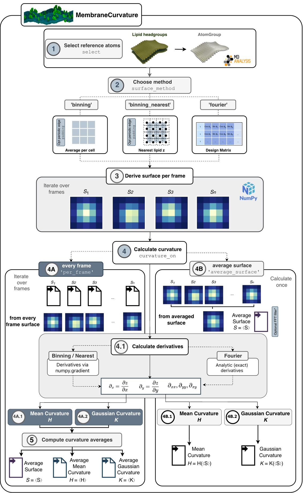
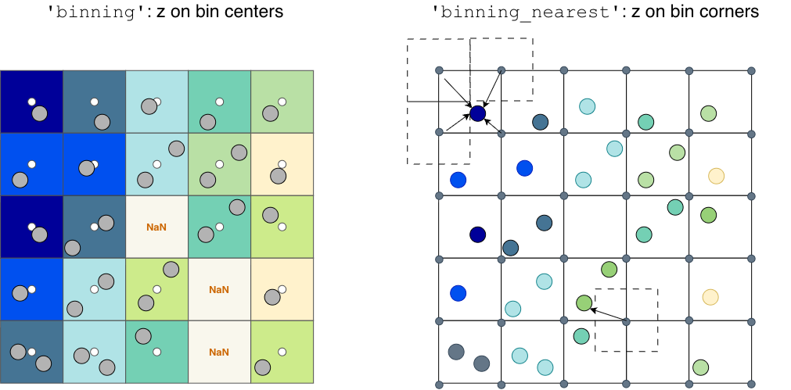
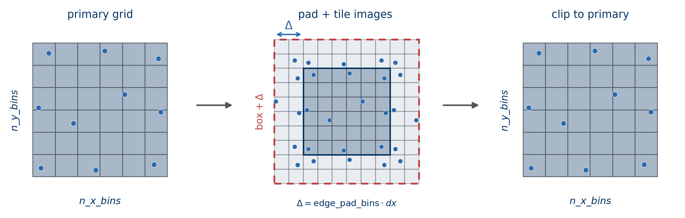
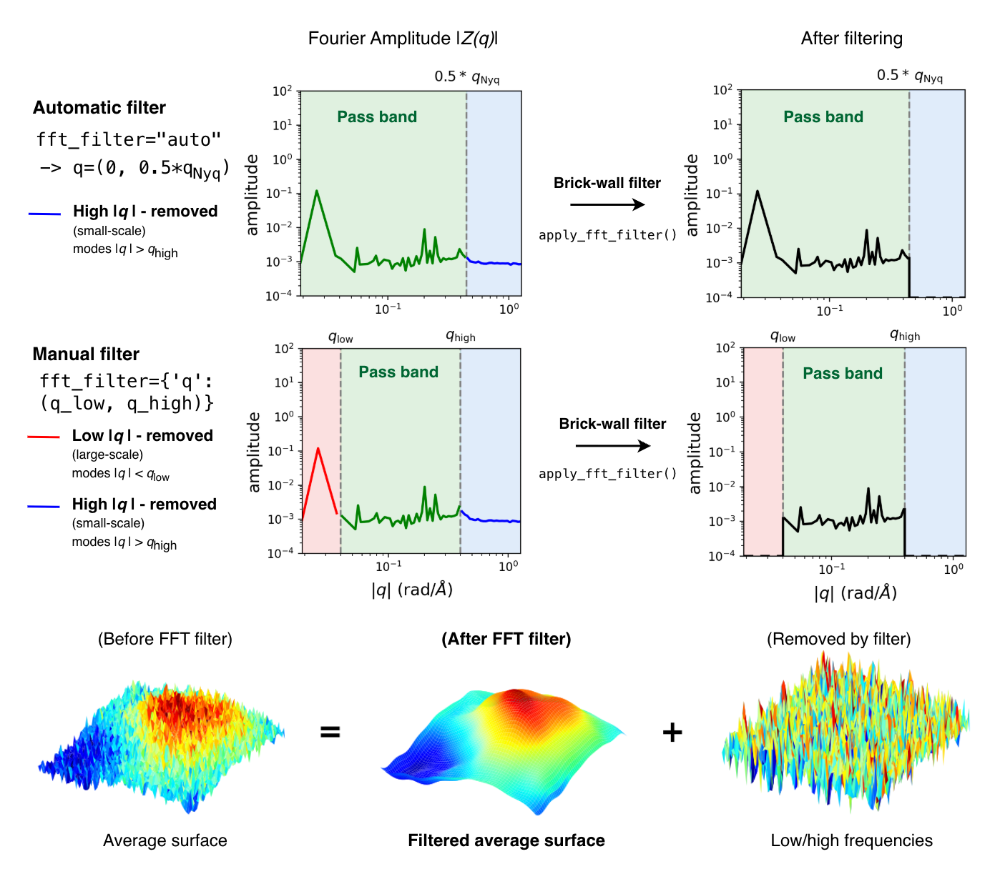
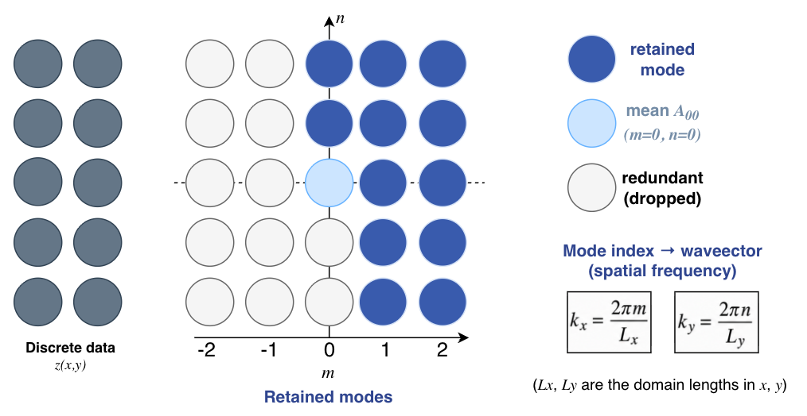
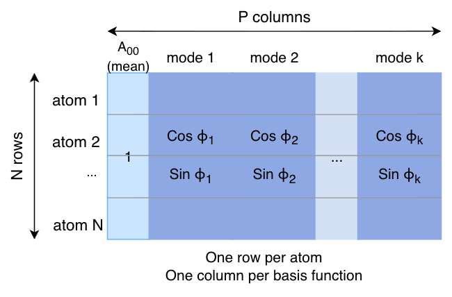
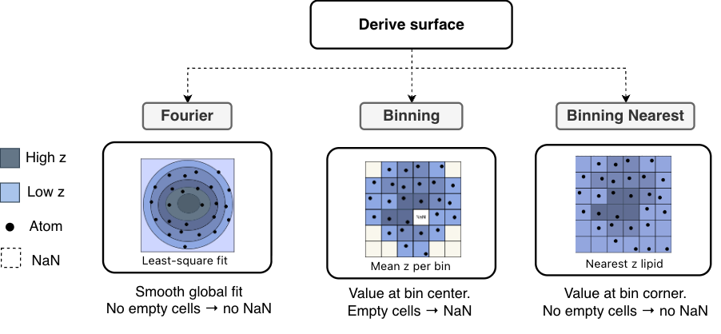
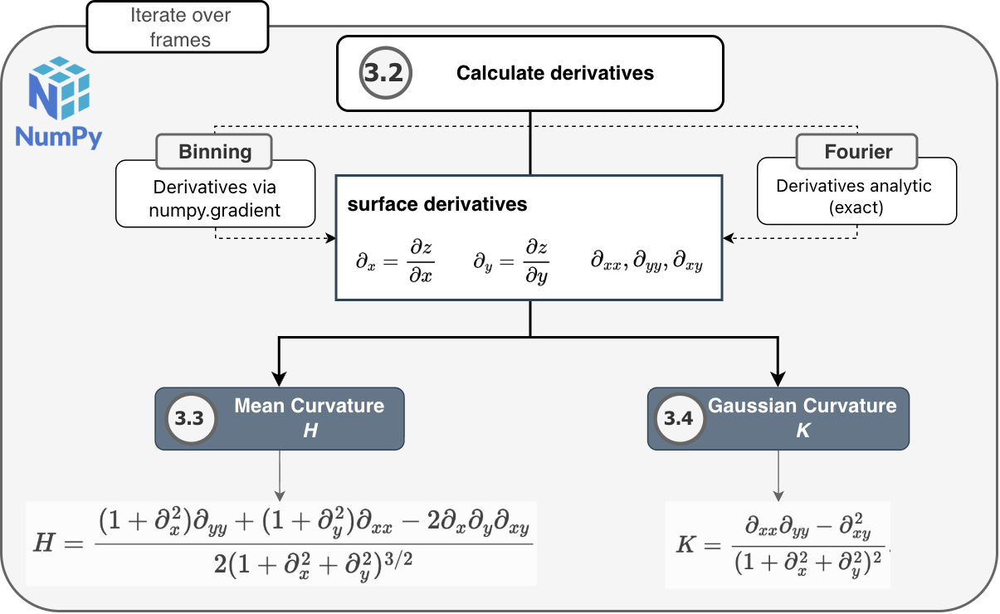

.. _algorithm:

Algorithm
=========================================================

Overview
---------

MembraneCurvature calculates mean and Gaussian curvature of surfaces derived
from atoms of reference in 4 steps:

:ref:`select-atoms`

:ref:`choose-surface-method`

:ref:`derive-surface-per-frame` 

:ref:`iterate`

A summary of the algorithm used in MembraneCurvature is shown in the following
diagram:

|diagram|

.. _select-atoms:

1. Select atoms of reference
-----------------------------

The first step in the algorithm consists of selecting atoms that will be used as
a reference to derive a surface. This selection will be contained in an
:class:`~MDAnalysis.core.groups.AtomGroup`. Typically in biological membranes,
lipid headgroups are the most common elements to use as an AtomGroup of
reference. 

|atoms|

.. _choose-surface-method:

2. Choose surface method
------------------------

Three surface-derivation methods are available, selected via the
``surface_method`` argument of :class:`~membrane_curvature.base.MembraneCurvature`:

- :ref:`fourier_method` (``surface_method='fourier'``, default method)

  A truncated 2D Fourier series is fitted to atom heights by linear
  least squares at each frame. Partial derivatives are evaluated analytically
  from the fitted series on the same grid as the binning method, avoiding
  finite-difference discretization error.
  See :mod:`~membrane_curvature.fourier_surface` for details.

- :ref:`binning_method` (``surface_method='binning'``)

  Atoms are assigned to bins on a regular grid and the height at each bin centre
  is set to the mean :math:`z`-coordinate of the atoms in that bin. Partial derivatives
  are estimated numerically from the discrete height field using
  :func:`numpy.gradient` with the physical bin spacing.
  See :mod:`~membrane_curvature.binning_surface` for details.

- :ref:`binning_nearest_method` (``surface_method='binning_nearest'``)

  Grid corners are placed on a regular grid and the height at each grid corner
  is set to the :math:`z`-coordinate of the nearest lipid in the :math:`xy` plane.
  Partial derivatives   are estimated numerically from the discrete height field using
  :func:`numpy.gradient` with the physical bin spacing.
  See :mod:`~membrane_curvature.binning_nearest_surface` for details.

.. _fourier_method:

2.1 Fourier method
--------------------

``surface_method='fourier'`` is the default method used in Membrane Curvature.
The Fourier method fits a truncated periodic 2D Fourier series to atom heights
by linear least squares at each frame. 
The truncation is controlled by ``fourier_m`` and ``fourier_n`` (default ``2``).
The basis is periodic on the simulation box with periods :math:`L_x` and :math:`L_y`,
so the fitted surface is consistent with periodic boundary conditions in :math:`x` and
:math:`y`.

The Fourier expansion used as a basis function is given by:

.. math::

   z(x, y) = A_{00} + \sum_{m=1}^{M}\sum_{n=1}^{N}\left[
     A_{mn}\cos\!\big(k_x m x + k_y n y\big)
     +\,B_{mn}\sin\!\big(k_x m x + k_y n y\big)
   \right].

Here, :math:`k_x` and :math:`k_y` are the fundamental wavevector components:

.. math::

  k_x = \frac{2\pi}{L_x}, \qquad k_y = \frac{2\pi}{L_y}

therefore the phase for the mode ``(m,n)`` is

.. math ::
  (k_x m x + k_y n y).

The Fourier method in MembraneCurvature is conceptually related to Fourier
surface modeling [CAG2009]_ and molecular Fourier shape descriptors [JMG1988]_,
but it is not a direct implementation of either paper. The least-squares
height-field fit used in MembraneCurvature is tailored to the AtomGroup of
reference given their cordinates.

.. [CAG2009] Shen et al., *Fourier method for large-scale surface modeling and registration*,
   Computers & Graphics (2009), doi: `10.1016/j.cag.2009.03.002`_.

.. [JMG1988] Leicester et al., *Description of molecular surface shape using Fourier descriptors*,
   Journal of Molecular Graphics (1988), doi: `10.1016/0263-7855(88)85008-2`_.

The full Fourier surface workflow comprises six steps, where the first four steps build and
solve a linear model that reconstructs the height field from plane-wave basis
functions. The final two steps evaluate the fitted surface and its derivatives
analytically on a grid of bin centres. In the following sections, we describe the
overall workflow implemented in MembraneCurvature. For details on each step and
the associated functions, see the API documentation in
:mod:`~membrane_curvature.fourier_surface`.

2.1.1 Choose Fourier modes
^^^^^^^^^^^^^^^^^^^^^^^^^^^
The first step is to choose a non-redundant set of Fourier modes with
:func:`~membrane_curvature.fourier_surface.fourier_mode_list` and determine the
total parameter count with :func:`~membrane_curvature.fourier_surface.n_fourier_parameters`.
This removes conjugate redundancy for real-valued surfaces and isolates the
mean term.

|fourier_modes|

2.1.2 Compute wavevectors
^^^^^^^^^^^^^^^^^^^^^^^^^^
We then compute the wavevector components (:math:`k_x`, :math:`k_y`) for each mode
using :func:`~membrane_curvature.fourier_surface._compute_wavevector`. These
set the phase :math:`\phi = k_x x + k_y y` that appears in each cosine/sine
basis function.

MembraneCurvature builds the non-redundant mode list via :func:`~membrane_curvature.fourier_surface.fourier_mode_list(M, N)`
and computes the total parameter count with :func:`~membrane_curvature.fourier_surface.n_fourier_parameters(M, N)`.
MembraneCurvature then validates that the :class:`~MDAnalysis.core.groups.AtomGroup` of reference
contains at least that many atoms and raises a :class:`ValueError` if the selection is too small.

.. warning::

  The explanation above is for the users to understand how MembraneCurvature builds the mode list and parameter count internally.

  **Do not pass the mode list** :func:`~membrane_curvature.fourier_surface.fourier_mode_list(M, N)`
  **or parameter count** :func:`~membrane_curvature.fourier_surface.n_fourier_parameters(M, N)`
  **directly. MembraneCurvature builds them internally.**

  **Users choose the Fourier truncation via the constructor arguments** ``fourier_m`` **and** ``fourier_n``
  By passing the maximum mode indices, MembraneCurvature builds the actual mode list and computes the total
  parameter count.

.. important::
  
  Because the derivatives are analytic, the Fourier method is not subject
  to finite-difference discretization error from the bin grid. Curvature
  still depends on the Fourier series truncation: use
  ``fourier_m = fourier_n = 2`` unless shorter wavelengths are required, and
  increase these values only while curvature improves systematically rather than
  becoming dominated by noise.

.. _build-design-matrix:

2.1.3 Build design matrix
^^^^^^^^^^^^^^^^^^^^^^^^^^
We then build the design matrix with :func:`~membrane_curvature.fourier_surface._build_fourier_matrix`.
Each row of the design matrix corresponds to an atom position and columns are the constant offset
followed by :math:`\cos(\mathbf{k}\cdot\mathbf{r})`, :math:`\sin(\mathbf{k}\cdot\mathbf{r})`
pairs for every retained mode. This matrix encodes the linear relation between the
Fourier coefficients and the observed heights.

The design matrix :math:`\mathbf{\Phi}` is a matrix of shape :math:`(N, P)` where
:math:`N` is the number of atoms in the :class:`~MDAnalysis.core.groups.AtomGroup`
of reference, and :math:`P` is the number of parameters. :math:`P` is defined
as :math:`P = 1 + 2\,n_{\text{modes}}` where :math:`n_{\text{modes}}` is the number of
the k retained Fourier modes. 

We can conceptualize :math:`\mathbf{\Phi}` as a matrix with rows corresponding to atom positions
and columns corresponding to the basis functions (cosine and sine of the wavevector :math:`k`)
evaluated at each atom position, so that the fitted heights satisfy the linear system of equations
:math:`\mathbf{z} \approx \mathbf{\Phi}\,\boldsymbol{\theta}`, from which we can solve
for the Fourier coefficients by solving a least-squares system.

A single row :math:`i` of :math:`\mathbf{\Phi}` for an atom at
:math:`\mathbf{r}_i=(x_i,y_i)` has the form:

.. math::

   \begin{aligned}
   \mathbf{\Phi}_{i,:} = \big[\, & 1, \\
   & \cos\big(\phi_{m_1,n_1}(\mathbf{r}_i)\big),\;
     \sin\big(\phi_{m_1,n_1}(\mathbf{r}_i)\big), \\
   & \ldots, \\
   & \cos\big(\phi_{m_{k},n_{k}}(\mathbf{r}_i)\big),\;
     \sin\big(\phi_{m_{k},n_{k}}(\mathbf{r}_i)\big)
   \,\big]
   \end{aligned}

With this formulation, we can solve for the Fourier coefficients by solving a least-squares system:

.. math::

  \mathbf{z} \approx \mathbf{\Phi}\,\boldsymbol{\theta}

where :math:`\boldsymbol{\theta}` is the vector of Fourier coefficients. These coefficients are
the ones we use to reconstruct the height field and calculate the derivatives.

|fourier_matrix|

Note that the column ordering follows the mode list returned by
:func:`~membrane_curvature.fourier_surface.fourier_mode_list`. For each retained
mode ``(m,n)`` the design matrix contains a cosine column then a sine column,
so columns appear as ``1, cos_{(m1,n1)}, sin_{(m1,n1)}, cos_{(m2,n2)}, sin_{(m2,n2)}, ...``.

.. important::

  **In summary:**

  The design matrix :math:`\mathbf{\Phi}` has shape :math:`(N, P)` where rows (:math:`N`) are atoms
  and columns (:math:`P`) are the basis functions. :math:`N` is the number of atoms in the
  :class:`~MDAnalysis.core.groups.AtomGroup` of reference. :math:`P` is the total number of parameters:
  
  .. math::
    P = 1 + 2\,n_{\text{modes}}

  which is the sum of one constant column (the mean term :math:`A_{00}`) plus two columns
  for each retained Fourier mode (one for cosine and one for sine).

2.1.4 Solve least-squares system
^^^^^^^^^^^^^^^^^^^^^^^^^^^^^^^^
We then solve the least-squares system for the Fourier coefficients using
:func:`~membrane_curvature.fourier_surface._fourier_fit_from_atoms`, which
calls :func:`~membrane_curvature.fourier_surface._solve_design_least_squares_svd`.
The latter function solves the linear least-squares system via truncated SVD.

This function solves the least-squares system for the Fourier coefficients and splits the solution
vector into the mean term :math:`A_{00}` and the per-mode amplitudes :math:`A_{mn}` and :math:`B_{mn}`
with :func:`~membrane_curvature.fourier_surface._unpack_coefficients`.
The returned coefficients are then used to evaluate the fitted height and its
analytic derivatives on the bin-centre mesh via :func:`~membrane_curvature.fourier_surface._eval_fourier_surface`.

The Fourier coefficients are obtained by linear least squares. The coefficients are obtained
by minimizing the residual sum of squares between the observed heights and the fitted heights:

.. math::

   \hat{\boldsymbol{\theta}} =
   \operatorname{arg\,min}_{\boldsymbol{\theta}}
   \lVert \mathbf{\Phi}\,\boldsymbol{\theta} - \mathbf{z} \rVert_2^2

via truncated SVD (:func:`~membrane_curvature.fourier_surface._solve_design_least_squares_svd`).
Because the model is linear in
:math:`\boldsymbol{\theta}`, no nonlinear optimisation is required.
If the effective rank of :math:`\mathbf{\Phi}` is smaller than :math:`P`,
a ``UserWarning`` is emitted. The truncated-SVD solver still returns a well-defined
minimum-norm least-squares solution, but the coefficients are not uniquely
determined by the data.

Overall, truncated SVD lets us fit the best surface even when the data can't uniquely
determine every Fourier coefficient, and it reduces noise amplification in modes that
are not well-determined by the data.

.. _binning_method:

2.2. Binning method
-------------------

The binning method derives a surface by partitioning the simulation box into
a regular ``n_x_bins`` x ``n_y_bins`` grid along the :math:`x` and
:math:`y` directions. For each bin we compute the average :math:`z` coordinate
of the atoms that fall inside the bin to form the discrete height field.

The resulting discrete height field is then differentiated numerically
using :func:`numpy.gradient` to obtain the partial derivatives required for
curvature calculation. Set ``surface_method='binning'`` explicitly to use
this method; it requires no additional parameters beyond the grid dimensions.

In the next section, we describe the details of the binning method.

.. _set-grid:

2.2.1. Set grid
^^^^^^^^^^^^^^^
The dimensions of the grid are determined by the size of the simulation box
contained in the :class:`~MDAnalysis.core.universe.Universe`.
The grid covers a rectangular domain in the membrane plane. By default that
domain matches the `x` and `y` edges of the simulation box from MDAnalysis'
:class:`~MDAnalysis.core.universe.Universe`. The grid comprises ``n_x_bins x n_y_bins``
bins along the `x` and `y` directions. Note that the user can define the number of
bins via the ``n_x_bins`` and ``n_y_bins`` arguments.

For every atom in the :class:`~MDAnalysis.core.groups.AtomGroup` of reference,
MembraneCurvature assigns it to a grid cell based on its `x` and `y` coordinates.
In practice, each coordinate pair ``(x, y)`` is mapped to a grid location
``[l, m]`` corresponding to a bin in the discretized membrane surface.

|grid|

Here, :math:`L_x` and :math:`L_y` denote the size of the simulation box in the 
`x` and `y` directions, respectively, while the size of the region covered by
the grid is represented by ``x_range`` and ``y_range``, along the `x` and `y`
directions, respectively. The spacing between grid points in each direction is
then determined by dividing these lengths by the number of bins.

.. note::
  Unless the user provides a different input, MembraneCurvature will determine
  the dimensions of the grid based on the size of the box on the first frame via
  :attr:`~MDAnalysis.core.universe.Universe.dimensions`.

  .. code-block:: python

      grid_dimension_x = (0, universe.dimensions[0])
      grid_dimension_y = (0, universe.dimensions[1])

2.2.2. Populate grid
^^^^^^^^^^^^^^^^^^^^^
Once the grid has been set, the :math:`z` coordinates of atoms assigned to each
cell are collected to form a height field over the grid.

Coordinates are converted to integer bin indices via scale factors

.. math::
   x\_factor = \frac{n\_{x\_bins}}{x_{\max} - x_{\min}}, \qquad
   y\_factor = \frac{n\_{y\_bins}}{y_{\max} - y_{\min}}.

We histogram the atoms of reference into a 2D grid by mapping each atom at
:math:`x` and :math:`y` coordinates to an integer bin index. The scale factor
converts coordinates from length units into bin units so that flooring yields an integer
index:

.. math::

   \mathrm{index} = \left\lfloor (x - x_{\min})\,x\_factor \right\rfloor,

and similarly for :math:`y`. 

Atoms that map outside the valid bin range
(negative indices or indices ≥ ``n_x_bins``/``n_y_bins``) are skipped. A
warning is issued reporting how many atoms fall outside the grid boundaries.

To populate the grid, :class:`~membrane_curvature.base.MembraneCurvature` wraps
``x`` and ``y`` of the reference :class:`~MDAnalysis.core.groups.AtomGroup`
into the unit cell when ``wrap=True`` (the default for
``surface_method='binning'``), while leaving ``z`` unchanged. Internally this
calls :meth:`~MDAnalysis.core.groups.AtomGroup.wrap` and then restores the
original ``z`` coordinates.

Empty bins (zero samples) are represented as :data:`numpy.nan` in the returned
``(n_x_bins, n_y_bins)`` array: the implementation replaces zero counts
with :data:`numpy.nan` and divides summed z-values by the per-bin counts. As a result,
trajectory averages use :func:`numpy.nanmean` and therefore ignore empty bins.

.. warning::
  
  The binning routine itself does not wrap :math:`x` and :math:`y` coordinates!
  :class:`~membrane_curvature.base.MembraneCurvature` wraps only when ``wrap=True`` is set.
  
  - Set ``wrap=True`` to wrap atoms back into the grid in :math:`x` and :math:`y` if you
    are calculating curvature on a **raw trajectory**. Heights in :math:`z` are preserved.
  - Set ``wrap=False`` to leave atoms outside the primary cell in :math:`x` and :math:`y`
    out of the bins when you are calculating curvature on:

    - a trajectory (membrane only or membrane-protein with position restraints) that
      already **pre-processed periodic boundary conditions**. 
    - a membrane-protein system that already **pre-processes rotational and translational
      fit for the protein**.
  
  Note that with ``padding=True``, periodic images in :math:`x` and :math:`y` are tiled into the
  buffer even if ``wrap=False``, so the usual ``wrap == False`` warning is not triggered.

.. _binning_nearest_method:

2.3. Binning nearest method
---------------------------

The binning nearest method derives a surface by assigning the :math:`z` coordinate
of the nearest lipid in the :math:`xy` plane. In contrast to the binning method, the
:math:`z` coordinate is assigned to each grid corner rather than the bin centre.
However, partial derivatives are estimated identically to the binning method, by
numerically differentiating the discrete height field using :func:`numpy.gradient`
with the physical bin spacing.

.. _set_grid_nearest:

2.3.1. Set grid
^^^^^^^^^^^^^^^

With the binning nearest method, the grid is set similarly to the binning method
(:ref:`set-grid`): the dimensions of the grid are determined by the size of the simulation
box contained in the Universe, and the domain matches the x and y edges from the MDAnalysis'
Universe. The grid also comprises ``n_x_bins x n_y_bins`` bins along the :math:`x` and
:math:`y` directions.

The difference is where the height field is sampled. Sample points sit at bin corners
along each axis, rather than at bin centres.

|binning_vs_nearest|

As a result, for the same bin counts and box extent, the binning nearest method grid is
offset by half a bin relative to the ``binning`` and ``fourier`` methods.

Unlike the binning method, the grid extent can also be set with ``grid_origin``.
With ``grid_origin='box'`` (default), the domain matches the simulation box in
:math:`x` and :math:`y`. With ``grid_origin='lipid_bbox'``, the domain is the axis-aligned
bounding box of the lipid reference points.

.. _populate_grid_nearest:

2.3.2. Populate grid
^^^^^^^^^^^^^^^^^^^^^

Once the corner grid has been set, each sample point is assigned the :math:`z`
coordinate of the nearest lipid in the :math:`xy` plane to form the height field.
This step is performed by the function 
:func:`~membrane_curvature.binning_nearest_surface.get_z_surface_nearest`.

The lipid reference points are built from the selected
:class:`~MDAnalysis.core.groups.AtomGroup` with
:func:`~membrane_curvature.binning_nearest_surface.lipid_center_positions`:
one point per residue. For a one-atom reference, the point is that bead's position.
When several atoms per residue are selected, they are reduced
to their mass-weighted centre, or to the geometric centre when masses are unavailable.
With the usual one-bead-per-lipid selection this matches the atoms used by
``binning`` and ``fourier``. Those methods do not collapse multi-atom residues to a
single centre.

For every bin corner, MembraneCurvature finds the nearest lipid reference point
in the :math:`xy` plane among all lipids in the selection, using
:func:`~MDAnalysis.lib.distances.distance_array` with the simulation box. The corner
then receives the :math:`z` of that lipid. Unlike the binning method, there is no
averaging over lipids within a cell: only the nearest lipid is considered, and membership
in a bin does not decide which lipids contribute.

.. important::

   Unlike the binning method, every sample point on the grid is assigned a value.
   As a result, the height field contains no empty bins and therefore no
   ``NaN`` values.

.. note::

   ``wrap=True`` is not valid with ``surface_method='binning_nearest'``.
   Periodicity is handled in the distance calculation rather than by wrapping
   atoms into the primary cell before the surface is built.

.. _derive-surface-per-frame:

3. Derive surfaces per frame
---------------------------------------------------

For every frame of the trajectory, the surface derived from the 
:class:`~MDAnalysis.core.groups.AtomGroup` is
calculated and stored in :attr:`~MembraneCurvature.results.z_surface`.
Similarly, the calculation of mean and Gaussian curvature is performed in every
frame and stored in :attr:`MembraneCurvature.results.mean` and
:attr:`MembraneCurvature.results.gaussian`, respectively.

The following sections describe the details of the three methods: binning, Fourier, and binning nearest,
used to derive the surface and calculate their respective surface derivatives.

.. _derive-surface:

3.1. Derive surface
^^^^^^^^^^^^^^^^^^^^

The surface is derived from atom positions using the selected method
and stored in :attr:`~MembraneCurvature.results.z_surface` for each frame.

With ``surface_method='binning'`` and ``surface_method='binning_nearest'``,
the height field is the discrete :math:`N_x \times N_y` array of per-cell,
mean :math:`z` for `'binning'`  and nearest :math:`z` for `'binning_nearest'`.
Bins containing no atoms are set to ``NaN`` and excluded from trajectory averages.

With ``surface_method='fourier'``, the height field is the fitted Fourier
series evaluated at bin centres after the least-squares fit described in
:ref:`fourier_method`. Because the representation is continuous and periodic
on the simulation box, every bin centre receives a value and no ``NaN``
entries arise.

|derive_surfaces_comparison|

.. _calculate-derivatives:

3.2. Calculate derivatives
^^^^^^^^^^^^^^^^^^^^^^^^^^^

Five partial derivatives of the height field are required by the
curvature formulas: the first derivatives :math:`\partial_x` and
:math:`\partial_y`, the second derivatives :math:`\partial_{xx}`
and :math:`\partial_{yy}`, and the mixed derivative :math:`\partial_{xy}`.

|surf_fourier|

.. important::
  
  **There is a key difference between the binning and Fourier methods when it comes to calculating the derivatives!**
  
  - With the binning methods (binning and binning nearest), the derivatives are estimated numerically
    from the discrete height field using :func:`numpy.gradient` with the physical
    spacings :math:`\Delta x` and :math:`\Delta y`, so that curvature values are in physical units.

  - With the Fourier method, the derivatives are evaluated analytically from the fitted Fourier
    series, so they are not subject to finite-difference discretization error. Curvature accuracy
    is instead governed by the Fourier series truncation.
  
  **Therefore, the three methods differ in what limits curvature accuracy:**
  The binning methods are sensitive to **finite-difference error** on the height grid,
  while the Fourier pipeline is sensitive to **how well the truncated series fits the atom data**; its
  derivatives are exact for that fitted surface at any output grid resolution, so refining the bin grid
  alone does not remove truncation or sampling limitations.
  
3.2.1. Binning + finite differences (``surface_method='binning'``)
^^^^^^^^^^^^^^^^^^^^^^^^^^^^^^^^^^^^^^^^^^^^^^^^^^^^^^^^^^^^^^^^^^

With ``surface_method='binning'``, these are estimated numerically from
the discrete height field using :func:`numpy.gradient` with the physical
spacings :math:`\Delta x` and :math:`\Delta y`, so that curvature values
are in physical units. Because this step uses finite differences, very
coarse grids may introduce discretization error.

.. note::

  These derivatives are evaluated using the actual grid spacing (``dx``, ``dy``),
  so that changes   in height are measured per unit distance in real space rather
  than per grid index. This makes curvature values physically meaningful and
  reduces their sensitivity to the chosen grid resolution.

  Curvature is computed from surface derivatives evaluated using the grid spacing
  (``dx``, ``dy``), ensuring results are expressed in physical units and are less
  sensitive to grid resolution. Because the derivatives are computed numerically,
  very coarse grids may still affect curvature estimates due to finite-difference
  discretization error.

For details on the binning methods, see API documentation in
:mod:`~membrane_curvature.binning_surface` and :mod:`~membrane_curvature.binning_nearest_surface`
that describe every associated function.

.. _binning-edge-padding:

3.2.1.1. Edge padding (``padding=True``)
^^^^^^^^^^^^^^^^^^^^^^^^^^^^^^^^^^^^^^^^^^^^

When ``padding=True`` with ``surface_method='binning'``,
:class:`~membrane_curvature.base.MembraneCurvature` expands the primary grid by a
periodic buffer of width :math:`\Delta` on each side. The buffer width is set by
``edge_pad_bins`` (default ``2``), so
:math:`\Delta_x = \mathrm{edge\_pad\_bins}\cdot dx` and
:math:`\Delta_y = \mathrm{edge\_pad\_bins}\cdot dy`.

The padded domain ``box + \Delta`` is then filled as follows:

1. Tile periodic atom images into the buffer via
   :func:`~membrane_curvature.padding.tile_xy_buffer`.
2. Bin mean heights on the expanded
   ``(n_x_bins + 2 * edge_pad_bins) x (n_y_bins + 2 * edge_pad_bins)``
   grid.
3. Evaluate mean and Gaussian curvature with finite differences on that padded
   height field.
4. Clip the buffer so returned arrays match the primary ``n_x_bins x n_y_bins``
   grid.

|padding|

.. warning::

  Padding is available for ``surface_method='binning'`` and **orthorhombic boxes only**.

  The binning grid is defined on the simulation $x$ and $y$ axes. Padding builds an
  expanded domain ``box + Δ`` by tiling axis-aligned periodic images
  :math:`(x + i L_x,\ y + j L_y,\ z)` into the buffer. The padded grid is then
  binned and evaluated, and the buffer is clipped back to the primary
  ``n_x_bins x n_y_bins`` grid. This axis-aligned tiling matches boxes whose
  in-plane vectors are orthogonal and aligned with the simulation axes, that is,
  orthorhombic boxes only.

  **Tilted or triclinic boxes need lattice-vector replicas and are not supported yet.**

The padding approach supplies edge and corner cells with periodic neighbors for
:func:`numpy.gradient`, which reduces finite difference artifacts that are
especially visible in second derivatives for Gaussian curvature. However, since 
the finite difference calculations access only the first neighbouring bins (`i-1`` and `i+1``),
padding by two bins (``edge_pad_bins``=2) is sufficient to evaluate derivatives at the boundaries
without introducing additional artifacts. Values of ``edge_pad_bins`` above ``4`` are unlikely
to change curvature and mainly increase computational cost.

Padding alone is usually enough to reduce edge artifacts, so you do not need
``fft_filter`` for that purpose. If you enable both ``padding`` and
``fft_filter``, the code filters the time-averaged primary height, then
computes average curvature from the filtered height. In that case the
filtered average is processed with a wrap-pad before curvature is evaluated,
rather than by tiling atom images. See :ref:`binning-fft-filter` for details.

.. _binning-fft-filter:

3.2.1.2. FFT filtering on the averaged surface (``fft_filter``)
^^^^^^^^^^^^^^^^^^^^^^^^^^^^^^^^^^^^^^^^^^^^^^^^^^^^^^^^^^^^^^^

A brick-wall filter is available when running with ``surface_method='binning'`` and the argument
``fft_filter``. By default, ``fft_filter`` is set to ``None``. When set to ``'auto'``, the
brick-wall filter is applied with the default low-pass ``(0, 0.5 * q_Nyq)`` from ``dx`` and ``dy``.
This filter is applied to the averaged surface once all frames have been processed. An additional
option is to pass a dictionary like ``{'q': (q_low, q_high)}`` to set the pass-band limits manually.

.. important::

  **The FFT filter is not applied to per-frame surfaces**.  Filtering is performed on the
  time-averaged height field, where thermal fluctuations have already been suppressed by averaging.

For both the ``'auto'`` and manual modes, the pass-band limits are resolved at construction time via
:func:`~membrane_curvature.fft_filtering.resolve_fft_filter` and applied at the end of the run with
:func:`~membrane_curvature.fft_filtering.apply_fft_filter`. See 
:mod:`~membrane_curvature.fft_filtering` for more details.

|fft_filter_plot|

For **filtered average surface** maps, :class:`~membrane_curvature.base.MembraneCurvature` 
averages the height field (:attr:`~membrane_curvature.base.MembraneCurvature.results.z_surface`)
over the trajectory and then smooths it in reciprocal space by zeroing all Fourier modes outside
the pass band defined by :math:`q_{\mathrm{low}} \leq |q| \leq q_{\mathrm{high}}` via
:func:`~membrane_curvature.fft_filtering.apply_fft_filter` before transforming back to real space.
The resulting filtered surface is stored in
:attr:`~membrane_curvature.base.MembraneCurvature.results.average_z_surface`, and then used to
calculate mean and Gaussian curvature via :func:`~membrane_curvature.curvature.mean_curvature` and
:func:`~membrane_curvature.curvature.gaussian_curvature`, respectively.

With ``fft_filter='auto'``, the pass band is :math:`(0,\ 0.5\,q_{\mathrm{Nyq}})`,
a conservative low-pass by default which retains the large-scale membrane shape while
suppressing short-wavelength noise. To control the band manually, pass
``fft_filter={'q': (q_low, q_high)}`` in rad/Å. The filter is disabled by default.

.. warning::

  Before the FFT filtering, empty bins are temporarily filled with the mean height of occupied
  bins, then restored to ``NaN`` after the inverse FFT. Large empty regions can
  introduce broadband spectral contamination and distort the filtered surface near gaps.
  Prefer denser binning or smaller empty regions when filtering is enabled.

.. note::

  The pass-band mask is isotropic in :math:`|q|`. For non-square bins
  (:math:`\Delta x \neq \Delta y`), modes that are resolvable along the finer axis
  but exceed :math:`q_{\mathrm{Nyq}} = \min(\pi/\Delta x,\, \pi/\Delta y)` are
  removed. Since :func:`numpy.fft.fft2` assumes a periodic grid, use ``wrap=True``,
  as recommended for binning in general.

3.2.2. Fourier fit + analytic derivatives (``surface_method='fourier'``)
^^^^^^^^^^^^^^^^^^^^^^^^^^^^^^^^^^^^^^^^^^^^^^^^^^^^^^^^^^^^^^^^^^^^^^^^

With ``surface_method='fourier'``, the partial derivatives are evaluated
analytically from the fitted Fourier series (see :ref:`fourier_method`),
so they are not subject to finite-difference discretization error.
Curvature accuracy is instead governed by the Fourier series truncation.

.. warning::
  Use ``fourier_m = fourier_n = 2`` unless shorter wavelengths are needed, and
  increase the mode indices only while curvature improves systematically.

.. note::
  Because no finite-difference step is involved, the analytic derivatives
  are exact with respect to the fitted surface, regardless of grid resolution.

For details on the Fourier method, see API documentation in
:mod:`~membrane_curvature.fourier_surface` that describes every step with its
associated functions.

.. _mean-curvature:

3.3. Mean curvature
^^^^^^^^^^^^^^^^^^^^

Mean curvature :math:`H` is calculated from the five partial derivative
arrays using the Monge-gauge formula:

.. math::

   H = \frac{(1+\partial_x^2)\,\partial_{yy} + (1+\partial_y^2)\,\partial_{xx}
             - 2\,\partial_x \partial_y \partial_{xy}}
            {2\,(1+\partial_x^2+\partial_y^2)^{3/2}}

via :func:`~membrane_curvature.curvature.mean_curvature_monge`.

The result has units Å :sup:`-1` and is stored in
:attr:`MembraneCurvature.results.mean` for each frame.

.. _gaussian-curvature:

3.4. Gaussian curvature
^^^^^^^^^^^^^^^^^^^^^^^^

Gaussian curvature :math:`K` is calculated from the same derivative
arrays using:

.. math::

   K = \frac{\partial_{xx}\,\partial_{yy} - \partial_{xy}^2}
            {(1+\partial_x^2+\partial_y^2)^{2}}

via :func:`~membrane_curvature.curvature.gaussian_curvature_monge`.

As for the calculation of mean curvature, Gaussian curvature is calculated for
every frame and the result has units Å :sup:`-2` and is stored in
:attr:`MembraneCurvature.results.gaussian` for each frame.

.. warning::

   The Monge-gauge formulas in steps 3.3 and 3.4 are exact. There is no
   small-gradient approximation applied. Both methods feed the same
   five derivative arrays into the same formulas; the only difference is
   how those derivatives were obtained in step :ref:`calculate-derivatives`.

.. _iterate:

4. Average over frames
-----------------------------------

The attributes :attr:`MembraneCurvature.results.average_mean` and
:attr:`MembraneCurvature.results.average_gaussian` contain the computed
values of mean and Gaussian curvature averaged over all the 
:attr:`~n_frames` in the trajectory.

After the trajectory is processed, MembraneCurvature stores the averaged maps in
:attr:`MembraneCurvature.results.average_z_surface<membrane_curvature.base.MembraneCurvature.results.average_z_surface>`,
:attr:`MembraneCurvature.results.average_mean`, and
:attr:`MembraneCurvature.results.average_gaussian` arrays, respectively.
Each array has shape ``(n_x_bins, n_y_bins)``.

How those averages are built depends on ``fft_filter``:

- With the default ``fft_filter=None``, the average maps are time averages of the
  per-frame arrays ``z_surface``, ``mean``, and ``gaussian``.
- With ``fft_filter`` enabled (``'auto'`` or a manual ``{'q': ...}`` dict),
  MembraneCurvature first time-averages ``z_surface``, applies one brick-wall
  filter to that average, and then computes ``average_mean`` and
  ``average_gaussian`` from the filtered average height.
  The per-frame arrays stay unfiltered.

|avg_frames|

.. |atoms| image:: ../_static/AtomsReference.png
  :width: 600
  :alt: atoms_ref

.. |grid| image:: ../_static/grid.png
  :width: 600
  :alt: Grid

.. |avg_frames| image:: ../_static/AvgFrames.png
  :width: 800
  :alt: avgFrames

.. _`10.1016/j.cag.2009.03.002`: https://doi.org/10.1016/j.cag.2009.03.002
.. _`10.1016/0263-7855(88)85008-2`: https://doi.org/10.1016/0263-7855(88)85008-2
