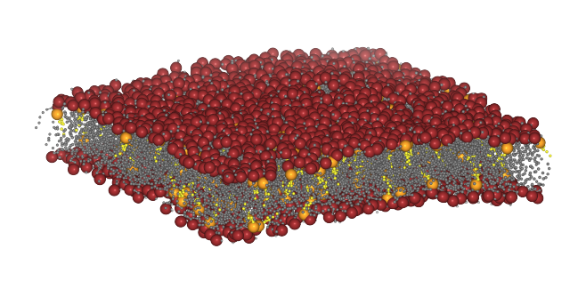
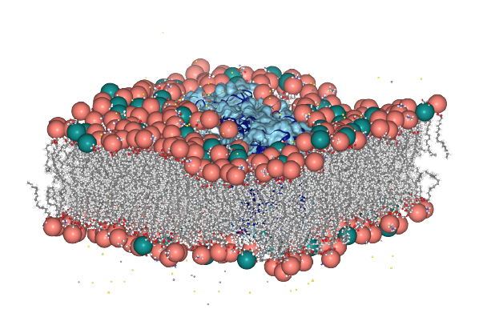

.. _tutorials:

Tutorials
=========================================================

**MembraneCurvature** derives 2D curvature profiles from an
:class:`~MDAnalysis.core.groups.AtomGroup` of reference. To help you to get the
most out of the MDAnalysis MembraneCurvature tool, we designed tutorials with
nice visualizatons covering different types of MD systems!

You can find the list of available tutorials below:

.. toctree::
   :maxdepth: 1
   :caption: Membrane-only systems

   Curvature_membrane-only_systems.ipynb

How to calculate curvature of a lipid bilayer of lipid composition POPC:POPE:CHOL and a
5:4:1 ratio from a Molecular Dynamics (MD) simulation carried out using the
Martini_ force field [Marrink2007]_.

.. toctree::
   :maxdepth: 1
   :caption: Membrane-protein systems 

   Curvature_membrane_protein_nopr_all_atom.ipynb

Use MembraneCurvature to derive 2D maps from a membrane-protein system with the NhaA 
antiporter [Kenney2018]_. MD simulations were carried out using the CHARMM36 force 
field [Huang2013]_.

References 
----------

.. [Kenney2018]  M. Kenney, Ian; Fan, Shujie; Beckstein, Oliver (2018): Molecular dynamics
                trajectory of membrane protein NhaA. figshare. Dataset.
                MDAnalysis. figshare. Fileset. doi: `10.6084/m9.figshare.7185203.v2`_.

.. [Marrink2007] Siewert J. Marrink, H. Jelger Risselada, Serge Yefimov, D. Peter Tieleman, 
                 and Alex H. de Vries. The MARTINI Force Field: Coarse Grained Model for 
                 Biomolecular Simulations. The Journal of Physical Chemistry B 2007 111 (27), 
                 7812-7824. doi: `10.1021/jp071097f`_. 

.. [Huang2013] Huang J, MacKerell AD Jr. CHARMM36 all-atom additive protein force field: 
               validation based on comparison to NMR data. J Comput Chem. 2013 Sep 30;
               34(25):2135-45. doi: `10.1002/jcc.23354`_. Epub 2013 Jul 6. PMID: 23832629; 
               PMCID: PMC3800559.

.. _Martini: http://cgmartini.nl/

.. _`10.1021/jp071097f`: https://pubs.acs.org/doi/10.1021/jp071097f
.. _`10.1002/jcc.23354`: https://doi.org/10.1002/jcc.23354
.. _`10.6084/m9.figshare.7185203.v2`: https://doi.org/10.6084/m9.figshare.7185203.v2