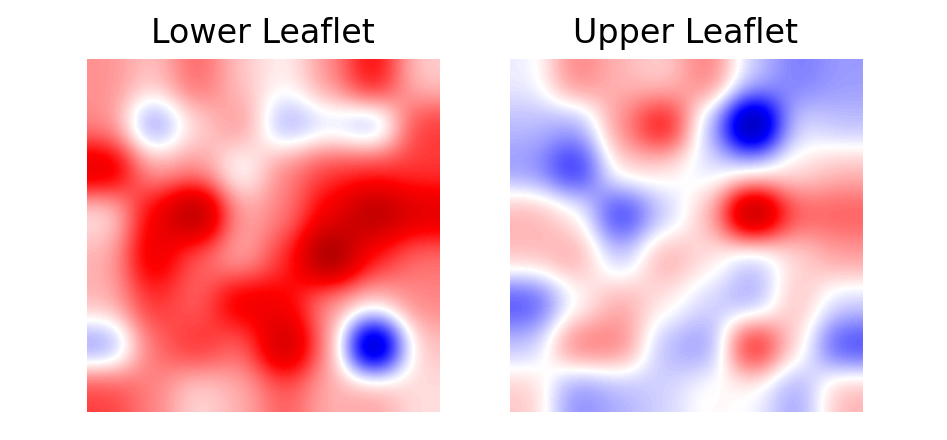
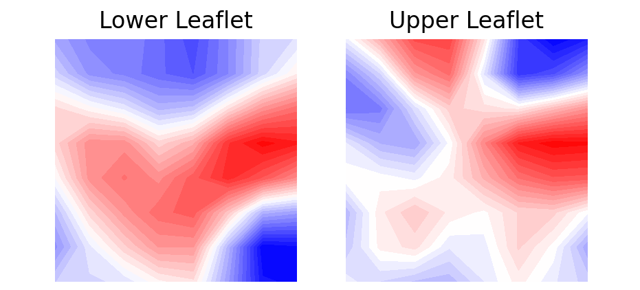

.. _visualization:

Visualization
=========================================================

This page provides examples of how to visualize membrane curvature via 
Matplotlib_. Two different approaches are suggested.

:ref:`plt.imshow`

:ref:`plt.contourf`

.. _plt.imshow:

1. imshow
----------------

A simple plot using `imshow` can be obtained like so::

        import matplotlib.pyplot as plt

        fig, ax = plt.subplots()
        ax.imshow(avg_mean_curvature, cmap='bwr', interpolation='gaussian', origin='lower')
        ax.set_title('Mean Curvature')
        plt.show()

With imshow_, each element of the array is plotted as a square in a matrix 
of `m x n` elements. The color of each square is determined by the value of 
the corresponding array element and the colormap of preference. 

For example, to visualize the results obtained in :ref:`membrane-only`, we can run::

        import MDAnalysis as mda
        from membrane_curvature.base import MembraneCurvature
        from MDAnalysis.tests.datafiles import Martini_membrane_gro
        import matplotlib.pyplot as plt

        universe = mda.Universe(Martini_membrane_gro)
        
        curvature_upper_leaflet = MembraneCurvature(universe, 
                                                    select='resid 1-225 and name PO4', 
                                                    n_x_bins=8, 
                                                    n_y_bins=8, 
                                                    wrap=True).run()

        curvature_upper_leaflet = MembraneCurvature(universe, 
                                                    select='resid 226-450 and name PO4', 
                                                    n_x_bins=8, 
                                                    n_y_bins=8, 
                                                    wrap=True).run()

        # extract mean curvature by leaflet
        mean_upper_leaflet = curvature_upper_leaflet.results.average_mean
        mean_lower_leaflet = curvature_lower_leaflet.results.average_mean

        # plot both leaflets
        leaflets = ['Lower', 'Upper']
        curvatures = [mean_lower_leaflet, mean_upper_leaflet]

        fig, (ax1, ax2) = plt.subplots(ncols=2)
        for ax, mc, lf in zip((ax1, ax2), curvatures, leaflets):
        ax.imshow(mc, interpolation='gaussian', cmap='seismic', origin='lower')
        ax.set_aspect('equal')
        ax.set_title('{} Leaflet'.format(lf))
        ax.axis('off')

Which will return 

|mean_mb_example|

.. _plt.contourf:

2. contourf
-------------------------------

You can use contour plots using `contourf`_. With this approach, contour lines
and filled contours of the obtained two-dimensional data are plotted. A contour
line connects points with the same curvature values.

When plotting using `plt.contourf`, an extra step is required to perform an interpolation. 
We suggest using `scipy.ndimage`_ gaussian filter as in::

        from scipy import ndimage

        leaflets = ['Lower', 'Upper']
        fig, (ax1, ax2) = plt.subplots(ncols=2, figsize=(5,3))
        for ax, mc, lf in zip((ax1, ax2), curvatures, leaflets):
        ax.contourf(ndimage.gaussian_filter(mc, sigma=1, order=0, mode='reflect'), 
                    cmap='bwr',
                    origin='lower', 
                    levels=30)
        ax.set_aspect('equal')
        ax.set_title('{} Leaflet'.format(lf))
        ax.axis('off')

Which produces the plot:

|mean_mb_contour|

.. _Matplotlib: https://matplotlib.org

.. _imshow: https://matplotlib.org/stable/api/_as_gen/matplotlib.pyplot.imshow.html

.. _contourf: https://matplotlib.org/stable/api/_as_gen/matplotlib.pyplot.contourf.html

.. _scipy.ndimage: https://docs.scipy.org/doc/scipy/reference/generated/scipy.ndimage.gaussian_filter.html

